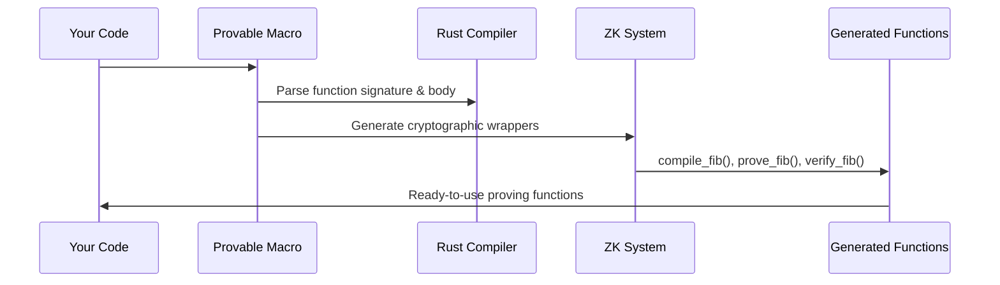

# Chapter 1: Provable Macro System

Welcome to Jolt! In this chapter, we'll explore the magical entry point that makes zero-knowledge proofs as easy as adding a single line to your Rust functions. The **Provable Macro System** is your gateway to creating functions that can prove they executed correctly without revealing their private inputs.

## What Problem Does This Solve?

Imagine you want to prove to someone that you correctly calculated the 50th Fibonacci number without revealing your calculation steps or intermediate values. Traditionally, this would require deep cryptographic knowledge and hundreds of lines of complex code. With Jolt's provable macro system, you can do this with just one line: `#[jolt::provable]`.

Let's start with a simple example to see this magic in action:

```rust
#[jolt::provable(memory_size = 10240, max_trace_length = 65536)]
fn fib(n: u32) -> u128 {
    let mut a: u128 = 0;
    let mut b: u128 = 1;
    // ... rest of fibonacci calculation
    b
}
```

This single annotation transforms your regular Rust function into a zero-knowledge provable function. Think of it like a compiler directive that wraps your function with cryptographic superpowers!

## Key Concepts

### The Magic Annotation

The `#[jolt::provable]` attribute is a Rust procedural macro - it's like a code generator that runs at compile time. When you add this annotation to your function, it doesn't just compile your function normally. Instead, it generates an entire ecosystem of functions around your original code:

```rust
// Your original function becomes this behind the scenes:
// - compile_fib()          - compiles the function for proving
// - prove_fib()           - generates a proof of execution  
// - build_verifier_fib()  - creates a verifier for the proof
// - analyze_fib()         - analyzes execution patterns
```

### Configuration Parameters

The macro accepts several parameters to configure the proving system:

```rust
#[jolt::provable(
    memory_size = 10240,        // How much memory the function can use
    max_trace_length = 65536,   // Maximum execution steps to track
    max_input_size = 1024,      // Maximum input data size
    max_output_size = 1024      // Maximum output data size
)]
```

Think of these as resource limits - like telling a virtual machine how much RAM and CPU it can use.

## Solving Our Use Case: Provable Fibonacci

Let's walk through how to use the provable macro system to create a zero-knowledge proof for our Fibonacci calculation:

### Step 1: Define Your Provable Function

```rust
#[jolt::provable(memory_size = 10240, max_trace_length = 65536)]
fn fib(n: u32) -> u128 {
    let mut a: u128 = 0;
    let mut b: u128 = 1;
    for _ in 1..n {
        let sum = a + b;
        a = b;
        b = sum;
    }
    b
}
```

This looks like a normal Rust function, but the macro generates much more code behind the scenes.

### Step 2: Compile and Preprocess

```rust
let target_dir = "/tmp/jolt-guest-targets";
let mut program = guest::compile_fib(target_dir);
let preprocessing = guest::preprocess_prover_fib(&mut program);
```

The `compile_fib` function (auto-generated by the macro) compiles your function into a format suitable for zero-knowledge proving. The preprocessing step sets up cryptographic parameters needed for efficient proof generation.

### Step 3: Build Prover and Verifier

```rust
let prove_fib = guest::build_prover_fib(program, preprocessing.clone());
let verify_fib = guest::build_verifier_fib(preprocessing);
```

These functions create specialized proving and verification functions. The prover can generate proofs, while the verifier can check if proofs are valid.

### Step 4: Generate and Verify Proofs

```rust
let (output, proof, io_device) = prove_fib(50);
let is_valid = verify_fib(50, output, false, proof);
```

Now you can prove that `fib(50)` was computed correctly and verify that proof - all without revealing the intermediate calculation steps!

## Under the Hood: How the Magic Works

When you add `#[jolt::provable]` to your function, here's what happens step by step:



### The Code Generation Process

The macro system performs several transformations on your code:

1. **Memory Layout Generation**: It creates functions to manage memory for the proving system:

```rust
pub fn memory_config_fib() -> jolt::MemoryConfig {
    MemoryConfig {
        max_input_size: 1024,
        max_output_size: 1024,
        stack_size: 4096,
        memory_size: 10240,
        program_size: None,
    }
}
```

This function defines how memory will be organized during proof generation.

2. **Compilation Function**: It generates a function that compiles your code for the proving system:

```rust
pub fn compile_fib(target_dir: &str) -> jolt::host::Program {
    let mut program = Program::new("your_package_name");
    program.set_func("fib");
    program.build_with_channel(target_dir, "stable");
    program
}
```

This compiles your function into a format that the [Jolt zkVM Core](02_jolt_zkvm_core_.md) can understand and prove.

3. **Proving Infrastructure**: The macro creates functions that handle the complex cryptographic operations:

```rust
pub fn prove_fib(
    program: jolt::host::Program,
    preprocessing: jolt::JoltProverPreprocessing,
    n: u32
) -> (u128, jolt::RV32IMJoltProof, jolt::JoltDevice) {
    // Complex cryptographic proving logic handled automatically
    let (proof, io_device, _) = JoltRV32IM::prove(&preprocessing, &elf_contents, &input_bytes);
    (return_value, proof, io_device)
}
```

This function coordinates with the [Program Compilation and Execution](03_program_compilation_and_execution_.md) system to generate proofs.

### Cross-Platform Magic

The macro system is smart about different compilation targets. It generates different code for:

- **Host environment**: Full proving and verification capabilities
- **Guest environment**: Lightweight execution for embedded systems  
- **WebAssembly**: Browser-compatible verification functions

```rust
#[cfg(not(target_arch = "wasm32"))]
pub fn prove_fib(...) { /* Full proving logic */ }

#[cfg(target_arch = "wasm32")]  
pub fn verify_fib_wasm(...) { /* Browser-friendly verification */ }
```

The macro automatically handles these platform differences, so your code works everywhere!

## The Generated Function Ecosystem

When you use `#[jolt::provable]`, you get an entire toolkit of functions:

- **Analysis functions**: `analyze_fib()` - understand your function's complexity
- **Debugging functions**: `trace_fib_to_file()` - see execution traces
- **Preprocessing functions**: `preprocess_prover_fib()` - set up cryptographic parameters  
- **Builder functions**: `build_prover_fib()` - create optimized provers
- **Core functions**: `prove_fib()`, `verify_fib()` - the main proving operations

Each function is automatically generated with proper error handling, memory management, and integration with Jolt's [Field Arithmetic and Cryptographic Fields](04_field_arithmetic_and_cryptographic_fields_.md) system.

## Conclusion

The Provable Macro System is your friendly gateway into zero-knowledge proofs. With just one line of code, it transforms ordinary Rust functions into cryptographically provable computations. It handles all the complex details - memory management, compilation, proof generation, and verification - so you can focus on your application logic.

This macro system seamlessly integrates with the [Jolt zkVM Core](02_jolt_zkvm_core_.md), which we'll explore in the next chapter to understand the underlying virtual machine that makes all this magic possible.

---

Generated by [AI Codebase Knowledge Builder](https://github.com/The-Pocket/Tutorial-Codebase-Knowledge)