# Chapter 2: Jolt zkVM Core

In the previous chapter, we learned how the [Provable Macro System](01_provable_macro_system_.md) provides a magical `#[jolt::provable]` annotation that transforms regular Rust functions into zero-knowledge provable computations. But what happens behind the scenes when you call `prove_fib()`? The answer lies in the **Jolt zkVM Core** - the heart of the entire system.

## What Problem Does This Solve?

Imagine you want to prove to your friend that you correctly executed a computer program without revealing the program's intermediate steps or secret inputs. This is like having a black box that can mathematically guarantee "Yes, I ran this program correctly" without showing the actual computation.

The Jolt zkVM Core is this magical black box. It's a **zero-knowledge virtual machine** that can:
- Take any RISC-V program (a standard instruction set that computers understand)
- Execute the program step by step
- Generate a cryptographic proof that the execution was correct
- Allow anyone to verify this proof without seeing the private data

Let's see how to use it with our Fibonacci example:

```rust
// This is what happens when you call prove_fib() from Chapter 1
let (proof, device, debug_info) = JoltRV32IM::prove(
    &preprocessing,
    elf_contents,  // Your compiled program
    &input_bytes   // Your input (n = 50)
);
```

This single function call executes your Fibonacci program and produces a cryptographic proof that it ran correctly!

## Key Concepts

### The Virtual Machine Architecture

Think of the Jolt zkVM Core like a special computer that keeps a detailed, cryptographically secure diary of everything it does:

```mermaid
sequenceDiagram
    participant User as Your Program
    participant VM as Jolt zkVM Core
    participant Tracer as Execution Tracer
    participant Prover as Proof Generator
    participant Verifier as Proof Verifier

    User->>VM: Execute fib(50)
    VM->>Tracer: Record each instruction
    Tracer->>VM: Complete execution trace
    VM->>Prover: Generate cryptographic proof
    Prover->>User: Return proof + result
    User->>Verifier: Here's my proof
    Verifier->>User: ✓ Verified correct!
```



### RISC-V Instructions as Building Blocks

RISC-V is like a universal language that computers speak. Every complex operation (like calculating Fibonacci numbers) breaks down into simple RISC-V instructions:

```rust
// Your Fibonacci loop becomes something like this in RISC-V:
// ADD  r1, r2, r3    // sum = a + b
// MOV  r2, r1        // a = b  
// MOV  r3, r1        // b = sum
// JUMP loop_start    // repeat
```

The zkVM Core processes each of these simple instructions and proves they were executed correctly.

### The Three-Phase Process

The zkVM Core works in three main phases:

1. **Execution**: Run your program and record every step
2. **Proof Generation**: Create cryptographic evidence of correct execution
3. **Verification**: Allow others to check the proof without re-running the program

## Solving Our Use Case: Proving Fibonacci Computation

Let's walk through how to use the Jolt zkVM Core to prove our Fibonacci calculation:

### Step 1: Preprocessing - Setting Up the System

```rust
let preprocessing = JoltRV32IM::prover_preprocess(
    bytecode,           // Your compiled program instructions
    memory_layout,      // How memory is organized
    initial_memory,     // Starting memory state
    1 << 16            // Maximum trace length (65536 steps)
);
```

This step is like preparing a specialized courtroom where your program will be "tried" and proven correct. The preprocessing sets up all the cryptographic parameters needed for efficient proof generation.

### Step 2: Generate the Proof

```rust
let (proof, io_device, debug_info) = JoltRV32IM::prove(
    &preprocessing,
    elf_contents,  // Your compiled Fibonacci program
    &[50u8]       // Input: calculate 50th Fibonacci number
);
```

This is where the magic happens! The zkVM Core:
- Executes your Fibonacci program step by step
- Records every instruction execution in a "trace"
- Generates a cryptographic proof that this trace is correct
- Returns the result along with the proof

### Step 3: Verify the Proof

```rust
let verifier_preprocessing = JoltVerifierPreprocessing::from(&preprocessing);
let result = JoltRV32IM::verify(
    &verifier_preprocessing,
    proof,
    io_device,
    debug_info
);
// result.is_ok() means the proof is valid!
```

Anyone can now verify that your Fibonacci calculation was done correctly without re-running the entire computation!

## Under the Hood: How the Magic Works

Let's dive deeper into what happens inside the zkVM Core when you call `prove()`:

### Phase 1: Program Tracing

```rust
// Inside JoltRV32IM::prove()
let (trace, final_memory_state, program_io) = 
    guest::program::trace(elf_contents, inputs, &memory_config);
```

The tracer executes your program instruction by instruction, creating a detailed log called an **execution trace**. Think of it like a flight recorder for your program:

```rust
// Each step in the trace looks like:
RV32IMCycle {
    instruction: ADD,    // What instruction was executed
    operands: [10, 20],  // What inputs it had  
    result: 30,          // What output it produced
    memory_state: [...], // How memory changed
}
```

### Phase 2: Polynomial Commitment 

The zkVM Core converts your execution trace into mathematical polynomials - think of these as mathematical "fingerprints" of your computation:

```rust
// Generate cryptographic commitments to execution data
let opening_proof_hints = Self::generate_and_commit_polynomials(&mut state_manager);

// Commit to all witness polynomials  
for commitment in commitments.iter() {
    transcript.append_serializable(commitment);
}
```

This step creates cryptographic "seals" on your computation data using the techniques from [Field Arithmetic and Cryptographic Fields](04_field_arithmetic_and_cryptographic_fields_.md).

### Phase 3: Multi-Stage Proof Generation

The proof generation happens in multiple stages, each proving different aspects of your computation:

```rust
// Stage 1: Prove basic instruction execution
spartan_dag.stage1_prove(&mut state_manager);

// Stage 2: Prove register operations  
let stage2_proof = BatchedSumcheck::prove(stage2_instances, ...);

// Stage 3: Prove memory operations
let stage3_proof = BatchedSumcheck::prove(stage3_instances, ...);

// Stage 4: Prove lookup table consistency  
let stage4_proof = BatchedSumcheck::prove(stage4_instances, ...);
```

Each stage uses the [Sumcheck Protocol](10_sumcheck_protocol_.md) to prove that different parts of your computation were done correctly. It's like having multiple expert witnesses each testify about different aspects of your program's execution.

### The State Manager: Orchestrating Everything

The `StateManager` is like a conductor of an orchestra, coordinating all the different components:

```rust
pub struct StateManager<'a, F: JoltField, FS: Transcript, PCS> {
    pub transcript: Rc<RefCell<FS>>,      // Cryptographic transcript
    pub proofs: Rc<RefCell<Proofs>>,     // Collection of all proofs
    pub commitments: Rc<RefCell<Vec<_>>>, // Polynomial commitments
    pub program_io: JoltDevice,          // Program input/output
    // ... other state
}
```

The StateManager keeps track of:
- The cryptographic transcript (like a tamper-proof logbook)
- All the generated proofs from different stages
- The polynomial commitments from [Commitment Schemes](08_commitment_schemes_.md)
- Program execution state and memory

### Verification: The Mirror Process

Verification mirrors the proving process but without re-executing the program:

```rust
// Verifier checks each stage proof
BatchedSumcheck::verify(stage2_proof, stage2_instances, ...);
BatchedSumcheck::verify(stage3_proof, stage3_instances, ...);
BatchedSumcheck::verify(stage4_proof, stage4_instances, ...);

// Final check: verify all polynomial openings
accumulator.reduce_and_verify(
    &preprocessing.generators,
    &commitments_map, 
    batched_opening_proof,
    transcript
);
```

The verifier checks that all the mathematical relationships hold without needing to see the actual computation steps. It's like checking that a complex mathematical proof is correct without re-deriving every step.

## The Proof Structure

The final proof that comes out of the zkVM Core contains several components:

```rust
pub struct JoltProof<F, PCS, FS> {
    opening_claims: Claims<F>,              // Claims about polynomial values
    commitments: Vec<PCS::Commitment>,      // Cryptographic commitments  
    proofs: Proofs<F, PCS, FS>,            // All the stage proofs
    trace_length: usize,                    // How long the program ran
    // ... other metadata
}
```

This proof is completely self-contained - anyone with just this proof and the verifier preprocessing can check that your program executed correctly!

## Integration with Other Components

The Jolt zkVM Core seamlessly integrates with other parts of the system:

- **[Program Compilation and Execution](03_program_compilation_and_execution_.md)**: Provides the compiled RISC-V bytecode
- **[Memory and RAM Management](07_memory_and_ram_management_.md)**: Handles program memory during execution
- **[Lookup Tables and Instructions](06_lookup_tables_and_instructions_.md)**: Proves complex operations were computed correctly
- **[R1CS Constraint System](09_r1cs_constraint_system_.md)**: Provides the mathematical framework for proofs

## Real-World Performance

The zkVM Core is designed for practical use. For our Fibonacci example:

```rust
// Typical performance for fib(50):
// - Proof generation: ~2-5 seconds
// - Proof size: ~100-500 KB  
// - Verification: ~10-100 milliseconds
// - Memory usage: ~1-4 GB during proving
```

The system automatically handles optimizations like parallel processing and efficient memory management to make proof generation as fast as possible.

## Conclusion

The Jolt zkVM Core is the beating heart of the zero-knowledge proving system. It transforms the simple `#[jolt::provable]` annotation from the [Provable Macro System](01_provable_macro_system_.md) into a sophisticated cryptographic proof that your computation was executed correctly.

The zkVM Core handles all the complex details - RISC-V instruction execution, polynomial commitments, multi-stage proof generation, and verification - so you can focus on writing your application logic. It's like having a cryptographic supercomputer that can prove the correctness of any computation while keeping your private data secret.

In the next chapter, we'll explore [Program Compilation and Execution](03_program_compilation_and_execution_.md) to understand how your Rust code gets transformed into the RISC-V instructions that the zkVM Core can process and prove.

---

Generated by [AI Codebase Knowledge Builder](https://github.com/The-Pocket/Tutorial-Codebase-Knowledge)