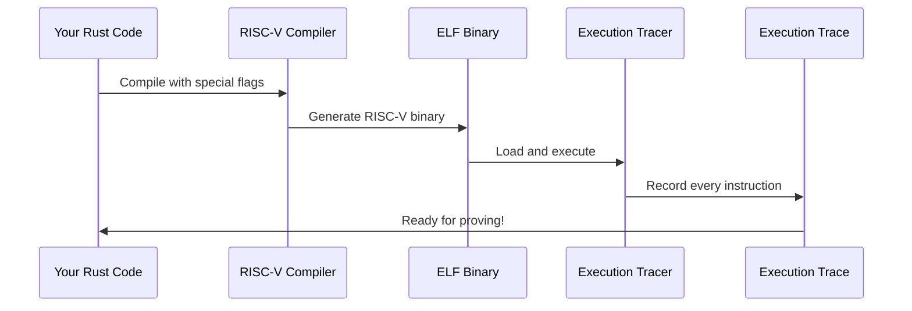

# Chapter 3: Program Compilation and Execution

In the previous chapter, we learned how the [Jolt zkVM Core](02_jolt_zkvm_core_.md) acts as the heart of the zero-knowledge proving system, executing programs and generating cryptographic proofs. But how does your Rust code actually become something that the zkVM Core can understand and execute? The answer lies in **Program Compilation and Execution** - the specialized toolchain that transforms your regular Rust programs into RISC-V assembly and runs them in a way that creates detailed execution traces for proof generation.

## What Problem Does This Solve?

Imagine you write a Rust function to calculate the 50th Fibonacci number. Your computer understands how to run this Rust code directly, but the Jolt zkVM Core needs something different - it needs RISC-V assembly instructions that it can trace and prove. It's like having a recipe written in English, but your chef only speaks French - you need a translator!

The Program Compilation and Execution system is this translator. It:
- Takes your Rust code and compiles it into RISC-V assembly (a universal computer language)
- Executes the program step-by-step while recording every single operation
- Creates a detailed "execution trace" that shows exactly what the program did
- Packages everything so the [Jolt zkVM Core](02_jolt_zkvm_core_.md) can generate proofs

Let's see this in action with our Fibonacci example:

```rust
// Step 1: Your Rust code gets compiled to RISC-V
let (bytecode, memory_init, program_size) = program.decode();

// Step 2: Execute and trace every step
let (trace, memory, io_device) = program.trace(&inputs);
```

This process transforms your high-level Rust code into a detailed execution log that can be mathematically proven!

## Key Concepts

### The RISC-V Instruction Set

Think of RISC-V like a basic vocabulary that any computer can understand. Your complex Fibonacci calculation gets broken down into simple operations:

```rust
// Your Rust: let sum = a + b;
// Becomes RISC-V instructions like:
ADD r1, r2, r3    // Add registers r2 and r3, store in r1
```

RISC-V is perfect for zero-knowledge proofs because every instruction is simple and predictable, making it easy to prove they were executed correctly.

### The Compilation Toolchain

The compilation process involves several specialized tools working together:



### Execution Tracing

When your program runs, the tracer acts like a detailed court reporter, recording absolutely everything:

```rust
// Each step in the execution gets recorded:
RV32IMCycle {
    instruction: ADD,           // What operation was performed
    operands: [10, 20],        // What inputs were used
    result: 30,                // What output was produced
    memory_changes: [...],     // How memory was modified
}
```

This trace becomes the "evidence" that the [Jolt zkVM Core](02_jolt_zkvm_core_.md) uses to generate proofs.

## Solving Our Use Case: Compiling and Tracing Fibonacci

Let's walk through how to compile and execute our Fibonacci program to generate a traceable execution:

### Step 1: Set Up the Program

```rust
let mut program = Program::new("fibonacci-guest");
program.set_func("fib");
program.set_memory_config(memory_config);
```

This creates a new program builder for our Fibonacci function. Think of it like setting up a specialized compiler workspace just for our function.

### Step 2: Build the RISC-V Binary

```rust
program.build("/tmp/jolt-targets");
let elf_contents = program.get_elf_contents().unwrap();
```

The `build()` function does the heavy lifting of compiling your Rust code into a RISC-V binary (called an ELF file). This is like translating your recipe from English to French - same instructions, different language.

### Step 3: Decode the Instructions

```rust
let (bytecode, memory_init, program_size) = program.decode();
```

This step examines the compiled binary and extracts:
- `bytecode`: The actual RISC-V instructions your program will execute
- `memory_init`: The initial state of memory before execution
- `program_size`: How much memory your program needs

### Step 4: Execute and Trace

```rust
let inputs = &[50u8]; // Calculate 50th Fibonacci number
let (trace, final_memory, io_device) = program.trace(inputs);
```

This is where the magic happens! The program executes your Fibonacci calculation while recording every single instruction in the `trace`. It's like having a security camera that records every step of the computation.

## Under the Hood: How the Magic Works

Let's dive deeper into what happens during compilation and execution:

### Phase 1: Specialized Compilation

The compilation process uses a custom RISC-V toolchain optimized for zero-knowledge proving:

```rust
// Special compiler flags for ZK-friendly code
let rust_flags = [
    "-C", "passes=lower-atomic",    // Simplify atomic operations
    "-C", "panic=abort",            // Handle errors cleanly
    "-C", "opt-level=z",            // Optimize for small size
];
```

These flags ensure the generated code is simple and predictable - perfect for creating proofs. The compiler targets `riscv32im-unknown-none-elf`, which means:
- `riscv32im`: 32-bit RISC-V with integer and multiply instructions
- `unknown-none-elf`: Bare-metal execution (no operating system)

### Phase 2: ELF Binary Processing

The compiled program becomes an ELF (Executable and Linkable Format) binary:

```rust
pub fn decode(elf: &[u8]) -> (Vec<RV32IMInstruction>, Vec<(u64, u8)>, u64) {
    let (mut instructions, raw_bytes, program_end) = tracer::decode(elf);
    
    // Expand complex instructions into simpler ones
    instructions = instructions.into_iter().flat_map(|instr| {
        match instr {
            RV32IMInstruction::DIV(div) => div.virtual_sequence(),
            RV32IMInstruction::MULH(mulh) => mulh.virtual_sequence(),
            // ... more complex instructions
            _ => vec![instr], // Simple instructions stay as-is
        }
    }).collect();
    
    (instructions, raw_bytes, program_end)
}
```

Some complex operations like division get expanded into sequences of simpler instructions. This makes them easier to prove using [Lookup Tables and Instructions](06_lookup_tables_and_instructions_.md).

### Phase 3: Memory Configuration

The system sets up a controlled memory environment for execution:

```rust
let memory_config = MemoryConfig {
    memory_size: 10240,      // Total memory available
    stack_size: 4096,        // Stack space for function calls
    max_input_size: 1024,    // Maximum input data size
    max_output_size: 1024,   // Maximum output data size
    program_size: Some(2048), // Size of the compiled program
};
```

This creates a sandbox where your program runs - like giving it a specific amount of workspace to operate in. The [Memory and RAM Management](07_memory_and_ram_management_.md) system uses this configuration to track all memory operations.

### Phase 4: Traced Execution

The execution tracer runs your program while recording everything:

```rust
pub fn trace(
    elf_contents: &[u8],
    inputs: &[u8],
    memory_config: &MemoryConfig,
) -> (Vec<RV32IMCycle>, Memory, JoltDevice) {
    
    // Set up the execution environment
    let mut emulator = RISCVEmulator::new(memory_config);
    emulator.load_program(elf_contents);
    emulator.load_inputs(inputs);
    
    let mut trace = Vec::new();
    
    // Execute instruction by instruction
    while !emulator.is_finished() {
        let cycle = emulator.step(); // Execute one instruction
        trace.push(cycle);           // Record what happened
    }
    
    (trace, emulator.memory(), emulator.io_device())
}
```

Each `step()` executes one RISC-V instruction and records:
- Which instruction was executed
- What inputs it used
- What output it produced  
- How it changed memory
- Any input/output operations

### The Execution Trace Structure

Each entry in the execution trace captures complete information about one instruction:

```rust
pub struct RV32IMCycle {
    pub instruction: RV32IMInstruction,  // ADD, SUB, MUL, etc.
    pub rs1: Option<u32>,                // First source register
    pub rs2: Option<u32>,                // Second source register  
    pub rd: Option<u32>,                 // Destination register
    pub imm: Option<u32>,                // Immediate value
    pub memory_ops: Vec<MemoryOp>,       // Memory reads/writes
}
```

This detailed trace becomes input to the [Jolt zkVM Core](02_jolt_zkvm_core_.md) for proof generation.

## Integration with the Proving System

The compilation and execution system integrates seamlessly with other Jolt components:

### Working with the Provable Macro

When you use `#[jolt::provable]`, the [Provable Macro System](01_provable_macro_system_.md) generates code that uses this compilation system:

```rust
// Generated by the macro system:
pub fn compile_fib(target_dir: &str) -> Program {
    let mut program = Program::new("your_package");
    program.set_func("fib");
    program.build(target_dir);
    program
}
```

### Memory Management Integration

The execution tracer works closely with [Memory and RAM Management](07_memory_and_ram_management_.md):

```rust
// Memory operations are tracked during execution
let memory_trace = trace.iter()
    .filter_map(|cycle| cycle.memory_op())
    .collect::<Vec<_>>();
```

Every memory read and write gets recorded and later proven using specialized memory consistency proofs.

### Instruction Proving Integration

Complex instructions use [Lookup Tables and Instructions](06_lookup_tables_and_instructions_.md) for efficient proving:

```rust
// Division gets proven using lookup tables
match instruction {
    RV32IMInstruction::DIV(div) => {
        // Use precomputed division lookup table
        lookup_table.prove_division(div.dividend, div.divisor, div.quotient)
    }
}
```

## Real-World Example: Fibonacci Execution

Let's trace through what happens when we execute `fib(5)`:

```rust
// Input: n = 5
let inputs = &[5u8];
let (trace, memory, io_device) = program.trace(inputs);

// The trace might look like:
// Step 1: ADDI r1, r0, 0      // a = 0
// Step 2: ADDI r2, r0, 1      // b = 1  
// Step 3: ADDI r3, r0, 1      // i = 1
// Step 4: BLT r3, r5, loop    // if i < n, goto loop
// Step 5: ADD r4, r1, r2      // sum = a + b
// Step 6: ADD r1, r2, r0      // a = b
// Step 7: ADD r2, r4, r0      // b = sum
// Step 8: ADDI r3, r3, 1      // i++
// Step 9: BLT r3, r5, loop    // if i < n, goto loop
// ... continues until done
```

Each step is precisely recorded, creating an unforgeable record of the computation.

## Performance and Optimization

The compilation system includes several optimizations for efficient proving:

```rust
// Automatic instruction expansion for better proving
let expanded_instructions = original_instructions
    .into_iter()
    .flat_map(|instr| match instr {
        // Complex operations become sequences of simple ones
        RV32IMInstruction::DIV(div) => div.virtual_sequence(),
        // Simple operations stay unchanged  
        simple => vec![simple],
    })
    .collect();
```

This ensures that even complex operations can be efficiently proven using the cryptographic techniques in [Field Arithmetic and Cryptographic Fields](04_field_arithmetic_and_cryptographic_fields_.md).

## Debugging and Analysis

The system provides tools for understanding your program's execution:

```rust
// Analyze instruction usage
let summary = program.trace_analyze(inputs);
let instruction_counts = summary.analyze::<BabyBear>();

// Most common instructions first:
// ADD: 1000 times
// MUL: 500 times  
// DIV: 50 times
```

This helps optimize your programs for faster proof generation.

## Conclusion

The Program Compilation and Execution system is the bridge between your high-level Rust code and the cryptographic proving system. It handles the complex task of compiling your code into RISC-V instructions, executing them in a controlled environment, and creating detailed execution traces that can be mathematically proven.

This system works hand-in-hand with the [Provable Macro System](01_provable_macro_system_.md) to provide a seamless development experience, while feeding precise execution data to the [Jolt zkVM Core](02_jolt_zkvm_core_.md) for proof generation. The detailed traces it creates become the foundation for all the cryptographic magic that follows.

In the next chapter, we'll explore [Field Arithmetic and Cryptographic Fields](04_field_arithmetic_and_cryptographic_fields_.md) to understand the mathematical foundations that make zero-knowledge proofs possible.

---

Generated by [AI Codebase Knowledge Builder](https://github.com/The-Pocket/Tutorial-Codebase-Knowledge)