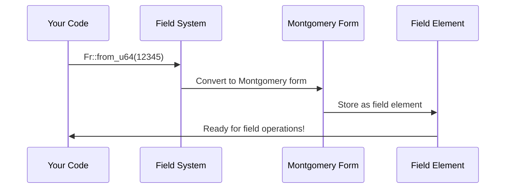

# Chapter 4: Field Arithmetic and Cryptographic Fields

In the previous chapter, we learned how [Program Compilation and Execution](03_program_compilation_and_execution_.md) transforms your Rust code into RISC-V instructions and creates detailed execution traces. But here's a fascinating question: how do we perform mathematical operations on these traces in a way that enables zero-knowledge proofs? The answer lies in **Field Arithmetic and Cryptographic Fields** - the special number systems that make all cryptographic magic possible.

## What Problem Does This Solve?

Imagine you're doing arithmetic with a clock. On a regular 12-hour clock, if it's 10 o'clock and you add 5 hours, you get 3 o'clock (not 15 o'clock). The numbers "wrap around" when they reach the maximum. Cryptographic fields work similarly, but instead of wrapping around at 12, they wrap around at a very large prime number.

This special arithmetic is crucial for zero-knowledge proofs because:
- **Uniformity**: All numbers are the same "size" (they fit in a fixed range)
- **Invertibility**: Every non-zero number has a multiplicative inverse 
- **Polynomial Friendly**: Perfect for the polynomial operations used in [Multilinear Polynomials](05_multilinear_polynomials_.md)
- **Cryptographic Security**: The large prime makes certain mathematical problems very hard

Let's see this in action with our Fibonacci example:

```rust
// Instead of regular u128 arithmetic:
let sum = a + b;  // This might overflow!

// We use field arithmetic:
let a = Fr::from_u128(fibonacci_a);
let b = Fr::from_u128(fibonacci_b);
let sum = a + b;  // This wraps around at field prime - safe!
```

This transformation allows the [Jolt zkVM Core](02_jolt_zkvm_core_.md) to prove arithmetic operations without worrying about overflow or size inconsistencies.

## Key Concepts

### The Field Prime

A cryptographic field is defined by a large prime number (called the **field prime** or **modulus**). For BN254 (the field Jolt uses), this prime is approximately 2^254:

```rust
// The BN254 field prime (simplified representation):
// p = 21888242871839275222246405745257275088548364400416034343698204186575808495617
```

All arithmetic operations happen "modulo" this prime - meaning results wrap around when they exceed this number.

### Field Elements vs Regular Numbers

Think of field elements as numbers wearing special mathematical "uniforms":

```rust
// Regular number
let regular_num = 12345u64;

// Field element - same value, different "uniform"
let field_elem = Fr::from_u64(12345);
```

The field element has the same value but follows different arithmetic rules designed for cryptographic operations.

### Modular Arithmetic in Action

Here's how field arithmetic differs from regular arithmetic:

```rust
// Regular arithmetic (can overflow)
let a = u64::MAX;
let b = 1u64;
// let sum = a + b;  // This would panic!

// Field arithmetic (wraps around safely)
let a_field = Fr::from_u64(u64::MAX);
let b_field = Fr::from_u64(1);
let sum_field = a_field + b_field;  // Safe! Wraps at field prime
```

The field arithmetic ensures all operations stay within a predictable range, making them perfect for cryptographic proofs.

## Solving Our Use Case: Field Operations for Fibonacci

Let's walk through how to use field arithmetic to handle our Fibonacci calculation in a zero-knowledge-friendly way:

### Step 1: Convert Regular Numbers to Field Elements

```rust
// Convert our Fibonacci inputs to field elements
let mut a = Fr::from_u64(0);  // First Fibonacci number
let mut b = Fr::from_u64(1);  // Second Fibonacci number
let n = Fr::from_u64(50);     // Calculate 50th Fibonacci number
```

Now all our numbers are "wearing the field uniform" and ready for cryptographic operations.

### Step 2: Perform Field Arithmetic

```rust
// Fibonacci loop using field arithmetic
for _i in 1..50 {
    let sum = a + b;  // Field addition - wraps at field prime
    a = b;            // Field assignment
    b = sum;          // All operations are "modulo field prime"
}
```

This looks like regular arithmetic, but every operation happens in the cryptographic field, ensuring consistency for proof generation.

### Step 3: Handle More Complex Operations

```rust
// Field multiplication
let product = a * b;

// Field division (uses multiplicative inverse)
let quotient = a / b;  // Only works if b != 0

// Field exponentiation
let squared = a.square();
```

Each operation maintains the field properties needed for the [Sumcheck Protocol](10_sumcheck_protocol_.md) and other cryptographic techniques.

## Under the Hood: How the Magic Works

Let's explore what happens when you perform field operations:

### Phase 1: Element Creation



When you create a field element, it gets converted to **Montgomery form** - a special representation that makes field multiplication very efficient.

### Phase 2: Field Addition

```rust
// Field addition is straightforward
impl Add for Fr {
    fn add(self, other: Fr) -> Fr {
        let result = self.0 + other.0;
        // If result >= field_prime, subtract field_prime
        if result >= FIELD_PRIME {
            Fr(result - FIELD_PRIME)
        } else {
            Fr(result)
        }
    }
}
```

Addition checks if the result exceeds the field prime and "wraps around" if needed - just like our clock analogy!

### Phase 3: Field Multiplication

Field multiplication is more complex because it uses Montgomery form for efficiency:

```rust
// Simplified field multiplication
impl Mul for Fr {
    fn mul(self, other: Fr) -> Fr {
        // Montgomery multiplication - very efficient!
        let result = montgomery_mult(self.0, other.0, FIELD_PRIME);
        Fr(result)
    }
}
```

Montgomery multiplication is a clever algorithm that performs modular multiplication without expensive division operations.

### Phase 4: Field Inversion

Division uses the **multiplicative inverse** - finding a number that, when multiplied by the original, gives 1:

```rust
// Field division: a / b = a * b^(-1)
let quotient = a * b.inverse().unwrap();
```

Finding the inverse uses the **Extended Euclidean Algorithm**, which is like finding the "undo button" for multiplication in the field.

## The JoltField Trait: Unifying All Operations

Jolt defines a `JoltField` trait that standardizes field operations across different field implementations:

```rust
pub trait JoltField: Copy + Sync + Send {
    // Convert regular numbers to field elements
    fn from_u64(n: u64) -> Self;
    fn from_i128(n: i128) -> Self;
    
    // Basic arithmetic
    fn square(&self) -> Self;
    fn inverse(&self) -> Option<Self>;
    
    // Optimized operations
    fn mul_u64(&self, n: u64) -> Self;
}
```

This trait allows Jolt to work with different cryptographic fields while maintaining the same interface.

### Optimized Small-Value Conversions

Converting small integers to field elements is a common operation, so Jolt uses lookup tables for efficiency:

```rust
// Precomputed lookup tables for fast conversion
lazy_static! {
    static ref SMALL_VALUE_LOOKUP: [Vec<Fr>; 2] = 
        Fr::compute_lookup_tables();
}

fn from_u64(n: u64) -> Fr {
    if n <= u16::MAX as u64 {
        // Fast lookup for small values
        SMALL_VALUE_LOOKUP[0][n as usize]
    } else {
        // Full computation for large values
        Fr::from_bigint(BigInt::from(n))
    }
}
```

This optimization makes field element creation much faster for the small values commonly used in RISC-V instructions.

## Working with Different Field Implementations

Jolt supports multiple field implementations for different use cases:

### BN254 Scalar Field (Production)

```rust
use ark_bn254::Fr;  // Main field for production proofs

let a = Fr::from_u64(12345);
let b = Fr::from_u64(67890);
let result = a * b;
```

BN254 provides 128 bits of security and is widely used in production zero-knowledge systems.

### Tracked Field (Development)

```rust
use jolt::field::tracked_ark::TrackedFr;  // For performance analysis

let a = TrackedFr::from_u64(12345);
let b = TrackedFr::from_u64(67890);
let result = a * b;  // Automatically counts operations!
```

`TrackedFr` wraps BN254 and counts field operations, helping optimize proof generation performance.

## Integration with Jolt Components

Field arithmetic integrates seamlessly with other Jolt components:

### Polynomial Operations

Fields provide the foundation for [Multilinear Polynomials](05_multilinear_polynomials_.md):

```rust
// Polynomial evaluation using field arithmetic
let polynomial_value = coeffs[0] 
    + coeffs[1] * x 
    + coeffs[2] * x.square()
    + coeffs[3] * x.square() * x;
```

All polynomial operations use field arithmetic to ensure consistency and enable efficient proving.

### Commitment Schemes

[Commitment Schemes](08_commitment_schemes_.md) rely on field arithmetic for cryptographic security:

```rust
// Committing to field elements
let commitment = commit_to_field_elements(&field_values);
```

The field properties ensure commitments are binding and hiding - essential for zero-knowledge proofs.

### Constraint Systems

[R1CS Constraint System](09_r1cs_constraint_system_.md) uses field arithmetic to represent computational constraints:

```rust
// R1CS constraint: a * b = c (all field elements)
let constraint = R1CSConstraint {
    a: field_a,
    b: field_b, 
    c: field_c,
};
```

Field arithmetic ensures constraints can be efficiently checked and proven.

## Real-World Performance Considerations

Field operations are performance-critical in zero-knowledge proofs:

```rust
// Typical field operation counts for fib(50):
// - Field additions: ~200 operations
// - Field multiplications: ~50 operations  
// - Field conversions: ~100 operations
// 
// Total proving time impact: ~10-50 milliseconds
```

The optimized field implementations in Jolt ensure these operations don't become bottlenecks in proof generation.

### Memory Usage

Field elements are carefully sized for efficiency:

```rust
impl JoltField for Fr {
    const NUM_BYTES: usize = 32;  // Each field element is 32 bytes
}
```

This fixed size ensures predictable memory usage and efficient batch operations.

## Debugging and Analysis with Tracked Fields

The `TrackedFr` type helps analyze field operation usage:

```rust
// Use tracked fields during development
let (proof, stats) = generate_proof_with_tracking(inputs);

println!("Field multiplications: {}", stats.mult_count);
println!("Field inversions: {}", stats.inverse_count);
```

This helps identify performance bottlenecks and optimize your provable functions.

## Common Patterns and Best Practices

### Converting Between Types

```rust
// Convert regular integers to field elements
let field_val = Fr::from_u64(regular_val);

// Convert back (when possible)
if let Some(regular_val) = field_val.to_u64() {
    println!("Converted back: {}", regular_val);
}
```

Not all field elements can convert back to regular integers (they might be larger than u64::MAX after field operations).

### Batch Operations

```rust
// Efficient batch conversion
let field_elements: Vec<Fr> = regular_values
    .iter()
    .map(|&x| Fr::from_u64(x))
    .collect();
```

Batch operations are more efficient than individual conversions for large datasets.

## Conclusion

Field Arithmetic and Cryptographic Fields provide the mathematical foundation that makes zero-knowledge proofs possible. They transform regular arithmetic into a cryptographically secure form where all operations are consistent, predictable, and perfect for polynomial mathematics.

These fields work seamlessly with the execution traces from [Program Compilation and Execution](03_program_compilation_and_execution_.md), providing the numerical foundation for the [Jolt zkVM Core](02_jolt_zkvm_core_.md) to generate proofs. Every arithmetic operation in your Fibonacci calculation gets converted to field arithmetic, ensuring the entire computation can be represented mathematically and proven cryptographically.

In the next chapter, we'll explore [Multilinear Polynomials](05_multilinear_polynomials_.md) to understand how these field elements get organized into the polynomial structures that enable efficient zero-knowledge proofs.

---

Generated by [AI Codebase Knowledge Builder](https://github.com/The-Pocket/Tutorial-Codebase-Knowledge)