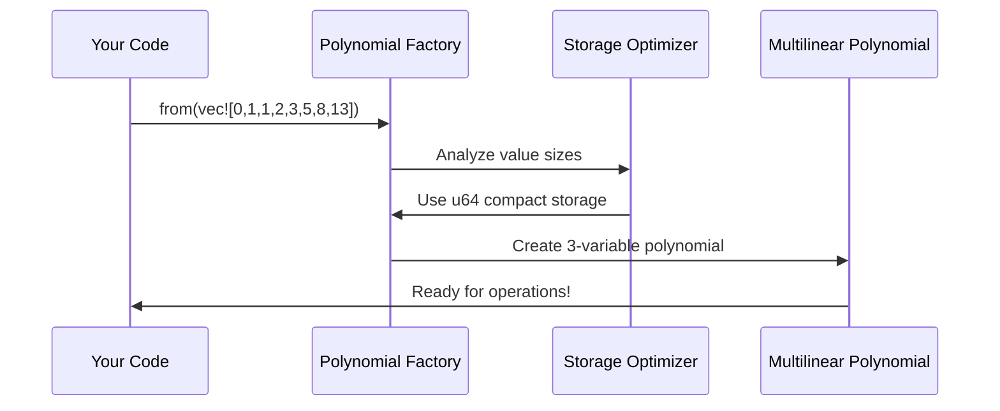

# Chapter 5: Multilinear Polynomials

In the previous chapter, we learned how [Field Arithmetic and Cryptographic Fields](04_field_arithmetic_and_cryptographic_fields_.md) provide the mathematical foundation for zero-knowledge proofs by ensuring all operations work within a predictable, secure number system. But here's an exciting question: how do we take the detailed execution traces from our programs and transform them into mathematical objects that can be efficiently proven? The answer lies in **Multilinear Polynomials** - the multi-dimensional mathematical structures that encode computation traces as polynomials.

## What Problem Does This Solve?

Imagine you're creating a digital photo album where each photo is organized by multiple tags: year, location, and event type. Instead of storing photos in a simple list, you organize them in a 3D cube where you can quickly find any photo by specifying its coordinates (year=2023, location=Paris, event=vacation). 

Multilinear polynomials work similarly for computation data. They take the execution traces from [Program Compilation and Execution](03_program_compilation_and_execution_.md) and organize them into multi-dimensional mathematical structures. This organization enables:

- **Compact Representation**: Large execution traces become manageable polynomial coefficients
- **Fast Operations**: Polynomial arithmetic enables efficient cryptographic operations  
- **Batch Processing**: Multiple values can be processed simultaneously
- **Proof Generation**: The structured format is perfect for the [Sumcheck Protocol](10_sumcheck_protocol_.md)

Let's see this in action with our Fibonacci example:

```rust
// Your Fibonacci execution trace becomes polynomial coefficients
let trace_values = vec![0u64, 1u64, 1u64, 2u64, 3u64, 5u64, 8u64, 13u64];
let poly = MultilinearPolynomial::from(trace_values);

// Now you can evaluate at any point using field arithmetic
let evaluation_point = [Fr::from_u64(3), Fr::from_u64(4), Fr::from_u64(5)];
let result = poly.evaluate(&evaluation_point);
```

This transformation allows the [Jolt zkVM Core](02_jolt_zkvm_core_.md) to work with your computation data as mathematical polynomials rather than raw execution traces!

## Key Concepts

### What Makes a Polynomial "Multilinear"?

A multilinear polynomial is like a mathematical formula where each variable appears only to the first power (no x² or x³). Think of it as a recipe where each ingredient is used exactly once:

```rust
// Multilinear: each variable (x, y, z) appears only once per term
// f(x,y,z) = 5 + 2x + 3y + 7z + 4xy + 6xz + 8yz + 9xyz

// NOT multilinear: x appears squared
// g(x,y) = x² + 2xy + 3y
```

This property makes multilinear polynomials perfect for representing Boolean circuit evaluations and execution traces.

### The Multi-Dimensional Structure

Multilinear polynomials organize data like a multi-dimensional spreadsheet:

```mermaid
graph TB
    A[1D Array: trace_values] --> B[3D Polynomial Structure]
    B --> C[Access by coordinates: f(x,y,z)]
    C --> D[Efficient evaluation and proving]
```

For a 3-variable polynomial, imagine a cube where each corner holds a coefficient value. The polynomial lets you smoothly interpolate between these corner values.

### Different Storage Types for Efficiency

Jolt uses different storage formats depending on the size of your data:

```rust
// Small values (0-255): Compact storage
let small_poly = MultilinearPolynomial::from(vec![1u8, 2u8, 3u8, 4u8]);

// Medium values (0-65535): Still compact  
let medium_poly = MultilinearPolynomial::from(vec![1000u16, 2000u16]);

// Large field elements: Full field storage
let large_poly = MultilinearPolynomial::from(vec![Fr::from_u64(12345)]);
```

This optimization ensures memory efficiency while maintaining fast operations using the field arithmetic from [Field Arithmetic and Cryptographic Fields](04_field_arithmetic_and_cryptographic_fields_.md).

## Solving Our Use Case: Encoding Fibonacci Execution

Let's walk through how to encode our Fibonacci execution trace as a multilinear polynomial:

### Step 1: Convert Execution Data to Polynomial

```rust
// Your Fibonacci execution produces values: 0, 1, 1, 2, 3, 5, 8, 13
let fib_values = vec![0u64, 1u64, 1u64, 2u64, 3u64, 5u64, 8u64, 13u64];

// Create a multilinear polynomial from these values
let fib_poly = MultilinearPolynomial::from(fib_values);
```

The polynomial automatically determines it needs 3 variables (since 2³ = 8 values) and stores the coefficients efficiently as `u64` values.

### Step 2: Evaluate the Polynomial

```rust
// Evaluate at a specific point using field arithmetic
let point = [Fr::from_u64(2), Fr::from_u64(3), Fr::from_u64(1)];
let result = fib_poly.evaluate(&point);

// This gives you the polynomial evaluation f(2,3,1)
println!("Polynomial evaluates to: {}", result);
```

The evaluation uses the advanced algorithms we'll explore later to efficiently compute the result in field arithmetic.

### Step 3: Use in Cryptographic Proofs

```rust
// The polynomial is now ready for commitment and proving
let commitment = commit_to_polynomial(&fib_poly);  

// Later, prove evaluations without revealing coefficients
let proof = prove_evaluation(&fib_poly, &point, result);
```

This integration with [Commitment Schemes](08_commitment_schemes_.md) enables zero-knowledge proofs about your computation.

## Under the Hood: How the Magic Works

Let's explore what happens when you create and evaluate multilinear polynomials:

### Phase 1: Polynomial Creation



The system automatically chooses the most efficient storage format based on your data size:

```rust
// The factory method determines the best representation
impl<F: JoltField> From<Vec<u64>> for MultilinearPolynomial<F> {
    fn from(coeffs: Vec<u64>) -> Self {
        // Ensure power-of-2 size for multilinear properties
        assert!(coeffs.len().is_power_of_two());
        
        // Create compact polynomial for efficient storage
        let poly = CompactPolynomial::from_coeffs(coeffs);
        Self::U64Scalars(poly)
    }
}
```

This automatic optimization ensures your polynomial uses minimal memory while supporting fast field operations.

### Phase 2: Polynomial Evaluation

When you evaluate a polynomial, it uses a clever "inside-out" algorithm for efficiency:

```rust
// Evaluate f(r₀, r₁, r₂) efficiently
pub fn inside_out_evaluate(&self, r: &[F]) -> F {
    // Start with all coefficient values
    let mut current = self.coeffs_as_field_elements();
    
    // Process each variable from right to left
    for i in (0..r.len()).rev() {
        let stride = 1 << i;
        let r_val = r[r.len() - 1 - i];
        
        // Combine pairs: f₀ + r*(f₁ - f₀)  
        for j in 0..stride {
            current[j] = current[j] + r_val * (current[j + stride] - current[j]);
        }
    }
    
    current[0] // Final result
}
```

This algorithm reduces from all coefficient values down to a single result by repeatedly combining pairs using the evaluation point.

### Phase 3: Efficient Field Conversion

For compact polynomials, field conversion is optimized using the `SmallScalar` trait:

```rust
// Convert small integers to field elements efficiently
impl SmallScalar for u64 {
    fn field_mul<F: JoltField>(&self, n: F) -> F {
        n.mul_u64(*self)  // Optimized multiplication
    }
    
    fn to_field<F: JoltField>(self) -> F {
        F::from_u64(self)  // Fast conversion to field
    }
}
```

This optimization uses the fast field conversion techniques from [Field Arithmetic and Cryptographic Fields](04_field_arithmetic_and_cryptographic_fields_.md) to ensure polynomial operations remain efficient.

## The Polynomial Types: A Closer Look

Jolt provides several polynomial variants optimized for different use cases:

### Compact Polynomials for Small Values

```rust
// For values that fit in small integer types
pub struct CompactPolynomial<T: SmallScalar, F: JoltField> {
    pub coeffs: Vec<T>,           // Original small values
    pub bound_coeffs: Vec<F>,     // Field elements after binding
    num_vars: usize,              // Number of polynomial variables
}
```

Compact polynomials store small values efficiently and convert to field elements only when needed for cryptographic operations.

### Dense Polynomials for Large Values

```rust
// For full field element coefficients
pub struct DensePolynomial<F: JoltField> {
    pub Z: Vec<F>,                // Field element coefficients
    num_vars: usize,              // Number of variables  
    len: usize,                   // Current polynomial length
}
```

Dense polynomials store field elements directly, providing maximum flexibility for complex computations.

### Wrapper Enum for Unified Interface

```rust
pub enum MultilinearPolynomial<F: JoltField> {
    U8Scalars(CompactPolynomial<u8, F>),
    U16Scalars(CompactPolynomial<u16, F>),  
    U64Scalars(CompactPolynomial<u64, F>),
    LargeScalars(DensePolynomial<F>),
}
```

The wrapper enum provides a unified interface while maintaining optimal storage for different data sizes.

## Integration with Jolt Components

Multilinear polynomials integrate seamlessly with other Jolt components:

### Sumcheck Protocol Integration

The [Sumcheck Protocol](10_sumcheck_protocol_.md) relies on multilinear polynomials for efficient proving:

```rust
// Generate sumcheck evaluations for proving  
let evals = poly.sumcheck_evals(index, degree, binding_order);

// Each evaluation represents part of the sumcheck proof
for (i, eval) in evals.iter().enumerate() {
    println!("Evaluation {}: {}", i, eval);
}
```

The polynomial provides the structured format needed for sumcheck's mathematical operations.

### Commitment Scheme Integration

[Commitment Schemes](08_commitment_schemes_.md) use polynomials to create cryptographic commitments:

```rust
// Commit to polynomial coefficients
let coeffs = poly.coeffs_as_field_elements();
let commitment = commitment_scheme.commit(&coeffs);

// Later prove evaluations without revealing coefficients
let proof = commitment_scheme.prove_evaluation(&poly, &point);
```

The polynomial structure ensures commitments are both binding and hiding.

### Memory Management Integration

[Memory and RAM Management](07_memory_and_ram_management_.md) uses polynomials to represent memory traces:

```rust
// Represent memory operations as polynomial coefficients
let memory_ops = vec![read_addr, write_addr, read_val, write_val];
let memory_poly = MultilinearPolynomial::from(memory_ops);

// Prove memory consistency using polynomial techniques
let consistency_proof = prove_memory_consistency(&memory_poly);
```

This representation enables efficient proofs about memory operation correctness.

## Advanced Features: Binding and Evaluation

Multilinear polynomials support advanced operations needed for zero-knowledge proofs:

### Variable Binding

```rust
// Bind the first variable to a specific field element
poly.bind(Fr::from_u64(42), BindingOrder::LowToHigh);

// This reduces the polynomial from n variables to (n-1) variables
assert_eq!(poly.get_num_vars(), original_vars - 1);
```

Binding fixes one variable to a specific value, reducing the polynomial's dimensionality while maintaining its mathematical properties.

### Batch Evaluation

```rust
// Evaluate multiple polynomials at the same point efficiently
let polys = vec![&poly1, &poly2, &poly3];
let point = vec![Fr::from_u64(1), Fr::from_u64(2)];

let results = MultilinearPolynomial::batch_evaluate(&polys, &point);
// Results contains evaluations of all polynomials
```

Batch evaluation reuses computation across multiple polynomials, significantly improving performance in proof generation.

## Real-World Performance Considerations

Multilinear polynomials are optimized for the performance requirements of zero-knowledge proofs:

```rust
// Typical performance for a 1000-element polynomial:
// - Creation: ~1-10 microseconds  
// - Evaluation: ~100 microseconds to 1 millisecond
// - Binding: ~50-500 microseconds
// - Memory usage: 8KB to 32KB depending on coefficient size
```

The system automatically chooses between serial and parallel algorithms based on polynomial size:

```rust
const PARALLEL_THRESHOLD: usize = 16;

if r.len() < PARALLEL_THRESHOLD {
    self.inside_out_serial(r)  // Faster for small polynomials
} else {
    self.inside_out_parallel(r)  // Scales better for large ones
}
```

This ensures optimal performance across different use cases.

## Debugging and Analysis Tools

Jolt provides tools for understanding polynomial operations:

```rust
// Analyze polynomial properties
println!("Variables: {}", poly.get_num_vars());
println!("Length: {}", poly.len());
println!("Coefficient at index 5: {}", poly.get_coeff(5));

// Check if polynomial has been bound during sumcheck
if poly.is_bound() {
    println!("Polynomial has been bound to {} variables", poly.get_num_vars());
}
```

These tools help optimize polynomial usage and debug complex proving systems.

## Conclusion

Multilinear Polynomials serve as the mathematical backbone that transforms raw execution traces into the structured format needed for efficient zero-knowledge proofs. They take the field arithmetic foundations from [Field Arithmetic and Cryptographic Fields](04_field_arithmetic_and_cryptographic_fields_.md) and the execution data from [Program Compilation and Execution](03_program_compilation_and_execution_.md), organizing everything into multi-dimensional polynomial structures.

These polynomials enable the [Jolt zkVM Core](02_jolt_zkvm_core_.md) to work with computation data mathematically rather than procedurally, unlocking the efficiency gains that make practical zero-knowledge proofs possible. They provide the compact representation, fast operations, and cryptographic compatibility that forms the foundation for all the advanced protocols in Jolt.

In the next chapter, we'll explore [Lookup Tables and Instructions](06_lookup_tables_and_instructions_.md) to understand how complex operations like division and bitwise operations are efficiently proven using precomputed polynomial tables.

---

Generated by [AI Codebase Knowledge Builder](https://github.com/The-Pocket/Tutorial-Codebase-Knowledge)