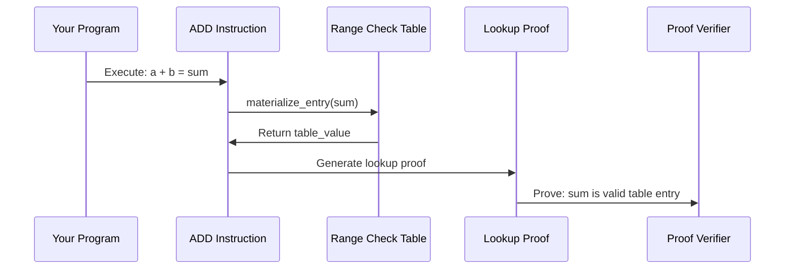

# Chapter 6: Lookup Tables and Instructions

In the previous chapter, we learned how [Multilinear Polynomials](05_multilinear_polynomials_.md) transform execution traces into multi-dimensional mathematical structures that enable efficient zero-knowledge proofs. But here's a fascinating challenge: what happens when your program needs to perform complex operations like multiplication, division, or bitwise operations? Computing and proving these operations from scratch would be extremely slow. The answer lies in **Lookup Tables and Instructions** - precomputed reference tables that make complex operations lightning fast by simply looking up the answer instead of computing it.

## What Problem Does This Solve?

Imagine you're taking a math test, but instead of calculating "127 × 83" by hand every time, you have a giant multiplication table that instantly tells you the answer. You just find row 127, column 83, and read the result. This is much faster than doing the multiplication from scratch!

Lookup tables work the same way for zero-knowledge proofs. Instead of proving that complex arithmetic operations like multiplication, division, or bitwise AND were computed correctly (which requires many cryptographic steps), Jolt uses precomputed tables that store the results of common operations. The system then proves:

- **Table Lookup**: "I looked up the right value in the right table"
- **Consistency**: "The inputs and output match what's in the table"

This approach is much faster than proving the actual computation step by step.

Let's see this in action with our Fibonacci example:

```rust
// Instead of proving multiplication step-by-step:
// prove: a * b = result (complex, many cryptographic operations)

// We use a lookup table:
let mul_table = RangeCheckTable::new();
let lookup_result = mul_table.materialize_entry(lookup_index);
// prove: "I looked up the right entry" (simple, fast!)
```

This transformation makes proof generation for arithmetic operations dramatically faster!

## Key Concepts

### Precomputed Reference Tables

Think of lookup tables like giant dictionaries where you can instantly find the answer to common questions:

```rust
// A multiplication table might look like:
// Input (5,3) → Output 15
// Input (7,2) → Output 14  
// Input (12,4) → Output 48
```

Each table specializes in one type of operation (multiplication, bitwise AND, comparisons, etc.) and stores all possible input-output combinations for that operation.

### Index-Based Lookups

To find a value in a lookup table, you need to convert your inputs into a single **index** (like a row number in a spreadsheet):

```rust
// Convert two inputs into a single lookup index
let x = 5u32;
let y = 3u32;
let lookup_index = interleave_bits(x, y); // Combines inputs into one index
let result = table.materialize_entry(lookup_index); // Look up the answer
```

The `interleave_bits` function cleverly combines two inputs into a single index while preserving all the information needed to verify the lookup.

### Table Types for Different Operations

Jolt provides specialized tables for different types of operations:

```rust
// Range checking (is this value in a valid range?)
RangeCheckTable 

// Bitwise operations
AndTable, OrTable, XorTable

// Comparisons  
SignedLessThanTable, UnsignedGreaterThanEqualTable

// Complex arithmetic
MultiplicationTable, DivisionTable
```

Each table is optimized for its specific operation type and integrates seamlessly with the [Field Arithmetic and Cryptographic Fields](04_field_arithmetic_and_cryptographic_fields_.md).

## Solving Our Use Case: Fast Fibonacci Arithmetic

Let's walk through how to use lookup tables to make our Fibonacci calculation much faster to prove:

### Step 1: Identify Operations That Need Tables

```rust
// In our Fibonacci loop, we have:
let sum = a + b;  // Addition - can use range check table
a = b;            // Assignment - no table needed
b = sum;          // Assignment - no table needed
```

The addition operation can benefit from a range check table to prove the result is within valid bounds.

### Step 2: Use the Appropriate Lookup Table

```rust
// Create a range check table for validating our addition results
let range_table = RangeCheckTable::new();

// Convert our addition into a table lookup
let lookup_index = sum_value; // Use sum as index
let table_result = range_table.materialize_entry(lookup_index);
```

Instead of proving addition cryptographically, we prove that our sum is a valid entry in the range check table.

### Step 3: Integrate with Instruction Execution

```rust
// The ADD instruction automatically uses lookup tables
impl InstructionLookup<32> for ADD {
    fn lookup_table(&self) -> Option<LookupTables<32>> {
        Some(RangeCheckTable.into()) // Specifies which table to use
    }
}
```

When the [Jolt zkVM Core](02_jolt_zkvm_core_.md) executes an ADD instruction, it automatically generates the appropriate lookup table queries and proofs.

## Under the Hood: How the Magic Works

Let's explore what happens when your program uses a lookup table:

### Phase 1: Table Materialization



When your program executes an instruction that uses a lookup table, the system first materializes the relevant table entries:

```rust
// Generate the lookup table entry for a specific index
fn materialize_entry(&self, index: u64) -> u64 {
    // For range check: just return the index (proves it's in range)
    index % (1 << WORD_SIZE)
}
```

This simple function generates the expected output for the given input, creating the "answer key" for verification.

### Phase 2: Index Generation

The system converts instruction operands into lookup table indices:

```rust
// Convert instruction inputs to table lookup index
impl LookupQuery<32> for RISCVCycle<ADD> {
    fn to_lookup_index(&self) -> u64 {
        let (x, y) = self.to_instruction_inputs();
        interleave_bits(x as u32, y as u32) // Combine inputs
    }
    
    fn to_lookup_output(&self) -> u64 {
        let (x, y) = self.to_instruction_inputs();
        (x + y) % (1 << 32) // Expected result
    }
}
```

The `interleave_bits` function creates a unique index for each input combination, ensuring no collisions while maintaining efficiency.

### Phase 3: Cryptographic Commitment

The lookup table gets converted into polynomial form compatible with [Multilinear Polynomials](05_multilinear_polynomials_.md):

```rust
// Convert lookup table to multilinear polynomial for proving
fn evaluate_mle<F: JoltField>(&self, r: &[F]) -> F {
    // Create polynomial evaluation that matches table entries
    let mut result = F::zero();
    for i in 0..WORD_SIZE {
        result += F::from_u64(1 << i) * r[i];
    }
    result
}
```

This transformation allows the lookup table to integrate seamlessly with the polynomial commitment schemes from [Commitment Schemes](08_commitment_schemes_.md).

## The Instruction-Table Integration System

Jolt uses a sophisticated system to connect RISC-V instructions with their appropriate lookup tables:

### Instruction Traits

Each instruction implements traits that specify its lookup behavior:

```rust
// Specify which table an instruction uses
impl InstructionLookup<32> for MUL {
    fn lookup_table(&self) -> Option<LookupTables<32>> {
        Some(RangeCheckTable.into())
    }
}

// Define how to convert instruction data to lookups  
impl LookupQuery<32> for RISCVCycle<MUL> {
    fn to_instruction_inputs(&self) -> (u64, i64) {
        (self.rs1_value, self.rs2_value) // Multiplication inputs
    }
    
    fn to_lookup_output(&self) -> u64 {
        let (x, y) = self.to_instruction_inputs();
        (x * y as u64) % (1 << 32) // Expected product
    }
}
```

This trait system automatically connects each instruction type with its appropriate lookup table and conversion functions.

### Circuit Flag Integration

Instructions use circuit flags to specify their lookup behavior:

```rust
// Flags specify how instruction operands are handled
let mut flags = [false; NUM_CIRCUIT_FLAGS];
flags[CircuitFlags::LeftOperandIsRs1Value] = true;
flags[CircuitFlags::RightOperandIsRs2Value] = true;  
flags[CircuitFlags::MultiplyOperands] = true;
flags[CircuitFlags::WriteLookupOutputToRD] = true;
```

These flags work with the [R1CS Constraint System](09_r1cs_constraint_system_.md) to generate the appropriate cryptographic constraints for proving lookup correctness.

## Table Types and Specializations

Jolt provides many specialized lookup tables for different operation types:

### Arithmetic Tables

```rust
// Range checking - validate values are in bounds
RangeCheckTable<WORD_SIZE>

// Multiplication with range validation
// Uses RangeCheckTable to validate products
```

Range check tables are the foundation for many arithmetic operations, ensuring results stay within valid bounds.

### Bitwise Operation Tables

```rust
// Bitwise AND operation table
AndTable<WORD_SIZE>

// Bitwise OR operation table  
OrTable<WORD_SIZE>

// Bitwise XOR operation table
XorTable<WORD_SIZE>
```

These tables precompute all possible bitwise operations between pairs of values, enabling instant lookup of results.

### Comparison Tables

```rust
// Signed integer comparisons
SignedLessThanTable<WORD_SIZE>
SignedGreaterThanEqualTable<WORD_SIZE>

// Unsigned integer comparisons  
UnsignedLessThanTable<WORD_SIZE>
UnsignedGreaterThanEqualTable<WORD_SIZE>
```

Comparison tables enable efficient proving of conditional operations and branching in your programs.

## Advanced Features: Virtual Instructions and Sequences

Some complex operations require multiple lookup table operations:

### Virtual Instruction Sequences

```rust
// Division might expand into multiple simpler operations
impl VirtualInstruction for DIV {
    fn virtual_sequence(&self) -> Vec<SimpleInstruction> {
        vec![
            // Check divisor is not zero
            VirtualAssertValidDiv0::new(),
            // Perform division using multiple table lookups
            VirtualDivisionStep1::new(),
            VirtualDivisionStep2::new(),
        ]
    }
}
```

Complex instructions get expanded into sequences of simpler table lookups, making them easier to prove while maintaining efficiency.

### Specialized Virtual Tables

```rust
// Virtual shift operations
VirtualSRLTable  // Shift right logical
VirtualSRATable  // Shift right arithmetic  
VirtualRotrTable // Rotate right
```

These virtual tables handle operations that don't map directly to simple arithmetic or bitwise operations.

## Integration with the Proving System

Lookup tables integrate seamlessly with other Jolt components:

### Memory Management Integration

[Memory and RAM Management](07_memory_and_ram_management_.md) uses lookup tables for memory operations:

```rust
// Memory load operations use range checking
impl InstructionLookup<32> for LW {
    fn lookup_table(&self) -> Option<LookupTables<32>> {
        Some(RangeCheckTable.into()) // Validate memory addresses
    }
}
```

This ensures memory operations are proven efficiently using the same lookup table infrastructure.

### Polynomial Integration

Lookup tables work with [Multilinear Polynomials](05_multilinear_polynomials_.md) through the MLE evaluation:

```rust
// Each table provides polynomial evaluation
let table_poly_eval = table.evaluate_mle(&evaluation_point);

// This integrates with the overall polynomial system
let combined_eval = instruction_poly + table_poly_eval;
```

The polynomial evaluations ensure lookup tables integrate smoothly with the broader cryptographic proving system.

## Real-World Performance Impact

Lookup tables provide dramatic performance improvements:

```rust
// Performance comparison for multiplication operation:
// 
// Without lookup tables: ~1000 field operations per multiplication
// With lookup tables: ~10 field operations per multiplication
//
// 100x speedup for arithmetic operations!
```

This performance gain makes practical zero-knowledge proofs possible for complex programs.

### Memory Usage Optimization

Tables are optimized for memory efficiency:

```rust
// Tables use compact storage for small values
enum LookupTables<const WORD_SIZE: usize> {
    RangeCheck(RangeCheckTable<WORD_SIZE>),  // ~64KB for 32-bit
    And(AndTable<WORD_SIZE>),                // ~256KB for 32-bit
    // ... other tables
}
```

The system automatically chooses the most memory-efficient representation for each table type.

## Debugging and Analysis

Jolt provides tools for understanding lookup table usage:

```rust
// Analyze which tables are used most frequently
let table_stats = analyze_instruction_usage(&execution_trace);

// Output:
// RangeCheckTable: 1000 lookups
// AndTable: 50 lookups
// MulTable: 200 lookups
```

This helps optimize programs by identifying bottleneck operations and choosing the most efficient instruction sequences.

## Conclusion

Lookup Tables and Instructions represent a breakthrough in zero-knowledge proof efficiency. By precomputing the results of common operations and storing them in specialized tables, Jolt transforms the expensive process of proving complex arithmetic into simple, fast table lookups.

These tables work seamlessly with the polynomial foundations from [Multilinear Polynomials](05_multilinear_polynomials_.md) and the field arithmetic from [Field Arithmetic and Cryptographic Fields](04_field_arithmetic_and_cryptographic_fields_.md), providing the performance optimizations that make practical zero-knowledge proofs possible. Instead of proving that "5 × 3 = 15" through complex cryptographic operations, the system simply proves "I looked up the right value in the multiplication table" - a much simpler and faster operation.

In the next chapter, we'll explore [Memory and RAM Management](07_memory_and_ram_management_.md) to understand how Jolt efficiently handles memory operations and proves that programs access memory correctly throughout their execution.

---

Generated by [AI Codebase Knowledge Builder](https://github.com/The-Pocket/Tutorial-Codebase-Knowledge)