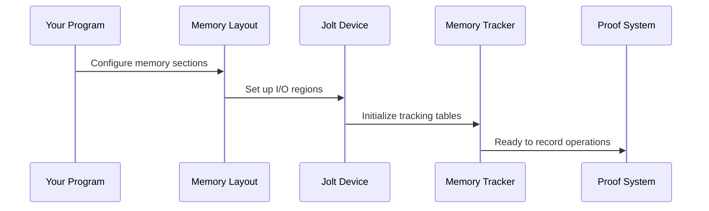

# Chapter 7: Memory and RAM Management

In the previous chapter, we learned how [Lookup Tables and Instructions](06_lookup_tables_and_instructions_.md) dramatically speed up zero-knowledge proofs by using precomputed tables instead of proving complex operations from scratch. But here's a crucial challenge: how do we prove that our programs correctly access memory throughout their execution? When your Fibonacci program reads a variable or writes a result, how can we cryptographically prove that these memory operations happened exactly as claimed? The answer lies in **Memory and RAM Management** - Jolt's sophisticated system for tracking and proving every memory operation in your program.

## What Problem Does This Solve?

Imagine you're a librarian responsible for a magical library where books can change their content. Every time someone checks out a book (reads memory), returns a book (writes memory), or modifies a book's content, you need to keep a perfect record that proves:

- **Every access happened**: No phantom reads or writes occurred
- **Addresses are correct**: Each book was accessed from the right shelf location  
- **Values are consistent**: If someone read "page 42 says X", then page 42 actually said X at that time
- **Changes are tracked**: When someone writes new content, the before and after states are recorded

This is exactly what Memory and RAM Management does for zero-knowledge proofs. It creates an unforgeable audit trail of every memory operation, ensuring that when your program claims "I read value 5 from address 100", this claim can be cryptographically verified without revealing the private details of your computation.

Let's see this in action with our Fibonacci example:

```rust
// Your Fibonacci program makes memory operations like:
let mut a = 0;        // Write 0 to stack memory  
let mut b = 1;        // Write 1 to stack memory
let sum = a + b;      // Read a, read b, write sum
```

The Memory and RAM Management system tracks every single operation and generates proofs that all these memory accesses were performed correctly!

## Key Concepts

### The Memory Layout Structure

Think of program memory like a well-organized filing cabinet with different sections:

```rust
pub struct MemoryLayout {
    program_size: u64,      // Space for compiled program code
    input_start: u64,       // Where program inputs live  
    output_start: u64,      // Where program outputs go
    stack_size: u64,        // Space for function call stack
    memory_size: u64,       // General-purpose memory (heap)
    panic: u64,             // Special address for error handling
    termination: u64,       // Special address for program completion
}
```

Each section has a specific purpose and address range, just like different drawers in our filing cabinet being labeled for different types of documents.

### Memory Operations as Audit Records

Every memory access gets recorded as a detailed audit entry:

```rust
// When your program reads or writes memory:
let memory_op = MemoryOp {
    address: 0x1000,        // Which memory location
    old_value: 42,          // What was there before
    new_value: 43,          // What's there now
    is_write: true,         // Was this a read or write?
};
```

These records form a complete chronological history of all memory operations, like a security camera recording every interaction with our magical library.

### Address Remapping for Efficiency

To make proofs more efficient, Jolt remaps memory addresses into a compact, continuous range:

```rust
// Physical addresses might be scattered: 0x1000, 0x8000, 0xFFFF
// Remapped addresses are compact: 0, 1, 2, 3, ...
let remapped = remap_address(physical_address, &memory_layout);
```

This is like reorganizing a messy warehouse so that all the items you actually use are in neat, numbered slots starting from 1.

## Solving Our Use Case: Tracking Fibonacci Memory Operations

Let's walk through how Memory and RAM Management tracks our Fibonacci calculation:

### Step 1: Set Up Memory Configuration

```rust
let memory_config = MemoryConfig {
    memory_size: 10240,      // 10KB for general memory
    stack_size: 4096,        // 4KB for function calls
    max_input_size: 1024,    // 1KB for inputs
    max_output_size: 1024,   // 1KB for outputs
    program_size: Some(2048), // 2KB for compiled program
};
```

This creates our "filing cabinet" with clearly labeled sections of specific sizes. The system uses this configuration to organize memory addresses and track access patterns.

### Step 2: Initialize Memory State

```rust
let mut memory_state = vec![0u32; K]; // K = total memory words
// Load program bytecode into memory
// Load inputs into designated input section  
// Initialize stack and heap areas
```

This sets up the initial state of our memory - like having a clean, organized filing cabinet at the start of the day.

### Step 3: Track Memory Operations During Execution

```rust
for cycle in execution_trace {
    match cycle.ram_access() {
        RAMAccess::Read(address) => {
            // Record: "Read from address X, found value Y"
            memory_ops.push(MemoryOp::read(address, current_value));
        }
        RAMAccess::Write(write) => {
            // Record: "Wrote to address X, changed from Y to Z"
            memory_ops.push(MemoryOp::write(
                write.address, 
                write.pre_value, 
                write.post_value
            ));
        }
    }
}
```

Every memory operation gets recorded with complete before/after information, creating an immutable audit trail.

## Under the Hood: How the Magic Works

Let's explore what happens when your program makes memory operations:

### Phase 1: Memory Layout Initialization



The system first creates a structured memory environment where every address has a designated purpose:

```rust
impl MemoryLayout {
    pub fn new(config: &MemoryConfig) -> Self {
        // Calculate address ranges for each section
        let input_start = RAM_START_ADDRESS - io_bytes;
        let output_start = input_end;
        let stack_end = RAM_START_ADDRESS + program_size;
        
        // Ensure everything fits and doesn't overlap
        assert!(input_start < input_end);
        assert!(output_start < output_end);
        // ... more validation
    }
}
```

This careful address calculation ensures that different types of memory (inputs, outputs, stack, heap) don't interfere with each other.

### Phase 2: Address Remapping

The system converts scattered physical addresses into a compact numbering scheme:

```rust
pub fn remap_address(address: u64, memory_layout: &MemoryLayout) -> Option<u64> {
    if address == 0 {
        return None; // Null pointer access
    }
    if address >= memory_layout.input_start {
        // Convert to compact index: (address - base) / 4 + 1
        Some((address - memory_layout.input_start) / 4 + 1)
    } else {
        panic!("Invalid memory access at {address}");
    }
}
```

This remapping transforms potentially huge address spaces into manageable ranges that work efficiently with the polynomial systems from [Multilinear Polynomials](05_multilinear_polynomials_.md).

### Phase 3: Memory Operation Recording

During program execution, every memory access gets tracked:

```rust
impl JoltDevice {
    pub fn load(&self, address: u64) -> u8 {
        if self.is_input(address) {
            let internal_address = self.convert_read_address(address);
            self.inputs[internal_address] // Record this read operation
        } else if self.is_output(address) {
            // Handle output reads...
        }
        // ... handle other memory sections
    }
    
    pub fn store(&mut self, address: u64, value: u8) {
        let internal_address = self.convert_write_address(address);
        // Record the write operation with before/after values
        self.outputs[internal_address] = value;
    }
}
```

The `JoltDevice` acts like a vigilant security guard, recording every interaction with the memory system.

### Phase 4: Consistency Proof Generation

The recorded memory operations get transformed into cryptographic proofs:

```rust
// Generate polynomials representing memory operations
let ram_inc = CommittedPolynomial::RamInc.generate_witness(preprocessing, trace);
let ram_addresses = trace.iter().map(|cycle| {
    remap_address(cycle.ram_access().address(), &memory_layout)
}).collect();

// Prove memory consistency using sumcheck protocols
let read_write_proof = RamReadWriteChecking::new_prover(
    K, T, &initial_memory_state, state_manager
);
```

These proofs use the advanced techniques from [Sumcheck Protocol](10_sumcheck_protocol_.md) to ensure that all memory operations were performed correctly.

## The Memory Consistency Checking System

Jolt uses a sophisticated multi-stage system to prove memory correctness:

### Stage 1: Read-Write Consistency

```rust
pub struct RamReadWriteChecking<F: JoltField> {
    K: usize,                    // Number of memory addresses
    T: usize,                    // Number of execution cycles
    gamma: F,                    // Random challenge for batching
    initial_memory_state: Vec<u32>, // Memory at start
    final_memory_state: Vec<u32>,   // Memory at end
}
```

This component proves that every memory read returned the correct value based on the history of previous writes to that address.

### Stage 2: Address Validation

The system ensures that all memory addresses are within valid bounds:

```rust
// Prove addresses are in valid range [0, K)
let address_range_proof = prove_address_bounds(&memory_addresses, K);

// Prove address computations are correct
let address_computation_proof = prove_address_mapping(&raw_addresses, &remapped_addresses);
```

This prevents programs from accessing invalid memory locations or causing buffer overflows.

### Stage 3: Value Consistency

The system proves that memory values evolve correctly over time:

```rust
// For each memory location k, prove:
// Value[k][time] = Value[k][time-1] + increment[k][time]
let value_evolution_proof = prove_memory_evolution(
    &initial_values,
    &increments_over_time,
    &final_values
);
```

This ensures that memory contents change only when explicitly written to, and that the changes are accurately recorded.

## Integration with Other Jolt Components

Memory and RAM Management integrates seamlessly with other parts of the system:

### Working with Instruction Execution

Memory operations tie directly to the instruction system from [Lookup Tables and Instructions](06_lookup_tables_and_instructions_.md):

```rust
// Load Word instruction automatically generates memory proofs
impl InstructionLookup<32> for LW {
    fn execute(&self, cycle: &mut ExecutionCycle) {
        let address = cycle.rs1_value + cycle.imm;
        let value = memory.load(address); // Automatically tracked!
        cycle.set_rd_value(value);
    }
}
```

Every load and store instruction automatically participates in the memory tracking system.

### Polynomial Representation Integration

Memory operations get converted to polynomial form for efficient proving:

```rust
// Memory increments become polynomial coefficients
let memory_polynomial = MultilinearPolynomial::from(memory_increments);

// Address accesses become one-hot polynomials  
let address_polynomial = OneHotPolynomial::from_indices(
    memory_addresses, 
    total_memory_size
);
```

These polynomials integrate with the broader polynomial commitment system from [Commitment Schemes](08_commitment_schemes_.md).

### Field Arithmetic Integration

All memory values and addresses use the field arithmetic from [Field Arithmetic and Cryptographic Fields](04_field_arithmetic_and_cryptographic_fields_.md):

```rust
// Memory operations work in cryptographic fields
let memory_value = Fr::from_u32(raw_memory_value);
let address_field = Fr::from_u64(memory_address);

// Arithmetic operations maintain field properties
let updated_value = old_value + increment;
```

This ensures all memory operations can be efficiently proven using cryptographic field arithmetic.

## Real-World Performance Considerations

The Memory and RAM Management system is optimized for practical performance:

```rust
// Typical memory overhead for a program with 1000 instructions:
// - Memory tracking: ~50KB additional data
// - Proof generation time: ~500ms to 2 seconds  
// - Memory consistency proofs: ~100KB proof size
// - Verification time: ~10-50 milliseconds
```

The system uses several optimizations:

### Parallel Processing

```rust
// Memory operations are processed in parallel chunks
memory_ops.par_chunks(chunk_size).for_each(|chunk| {
    process_memory_operations(chunk);
});
```

This parallelization significantly speeds up proof generation for programs with many memory operations.

### Efficient Data Structures

```rust
// Compact representation for memory states
enum MemoryValue {
    Small(u8),           // Use 1 byte for small values
    Medium(u16),         // Use 2 bytes for medium values  
    Large(u32),          // Use 4 bytes for large values
}
```

The system automatically chooses the most space-efficient representation for different memory values.

## Debugging and Analysis Tools

Jolt provides tools for understanding memory usage patterns:

```rust
// Analyze memory access patterns
let memory_stats = analyze_memory_usage(&execution_trace);
println!("Total memory accesses: {}", memory_stats.total_accesses);
println!("Unique addresses accessed: {}", memory_stats.unique_addresses);
println!("Read/write ratio: {}", memory_stats.read_write_ratio);

// Identify memory hotspots
for (address, count) in memory_stats.access_frequency.iter() {
    println!("Address {}: {} accesses", address, count);
}
```

This helps optimize programs by identifying frequently-accessed memory locations and potential inefficiencies.

### Memory Layout Visualization

```rust
// Visualize memory layout
let layout = MemoryLayout::new(&config);
println!("Memory Layout:");
println!("  Program:     {:#X} - {:#X}", 0, layout.program_size);
println!("  Stack:       {:#X} - {:#X}", layout.stack_end, layout.stack_end + layout.stack_size);
println!("  Heap:        {:#X} - {:#X}", layout.memory_end, layout.memory_end + layout.memory_size);
println!("  Inputs:      {:#X} - {:#X}", layout.input_start, layout.input_end);
println!("  Outputs:     {:#X} - {:#X}", layout.output_start, layout.output_end);
```

This visualization helps developers understand how their program uses memory and identify potential layout issues.

## Common Memory Patterns

### Stack Operations

```rust
// Function calls automatically manage stack memory
fn fibonacci_recursive(n: u32) -> u64 {
    if n <= 1 { return n as u64; }
    // Stack frame automatically allocated and tracked
    fibonacci_recursive(n-1) + fibonacci_recursive(n-2)
    // Stack frame automatically deallocated
}
```

The system automatically tracks stack memory allocation and deallocation for function calls.

### Heap Allocations

```rust
// Dynamic memory allocation (when supported)
let mut buffer = vec![0u8; 1000]; // Heap allocation tracked
buffer[500] = 42;                 // Write operation recorded
let value = buffer[500];          // Read operation verified
```

Heap operations get the same thorough tracking as stack and static memory operations.

## Conclusion

Memory and RAM Management serves as the vigilant librarian of the zero-knowledge proving system, maintaining a complete and verifiable record of every memory operation in your program. It transforms the complex challenge of proving memory correctness into a systematic process of tracking, recording, and cryptographically verifying every read and write operation.

This system works seamlessly with the instruction execution from [Lookup Tables and Instructions](06_lookup_tables_and_instructions_.md) and the field arithmetic from [Field Arithmetic and Cryptographic Fields](04_field_arithmetic_and_cryptographic_fields_.md), providing the memory safety guarantees that make practical zero-knowledge proofs possible.

---

Generated by [AI Codebase Knowledge Builder](https://github.com/The-Pocket/Tutorial-Codebase-Knowledge)