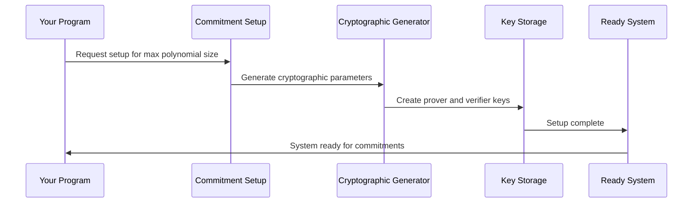

# Chapter 8: Commitment Schemes

In the previous chapter, we learned how [Memory and RAM Management](07_memory_and_ram_management_.md) tracks every memory operation in your program and proves they were performed correctly. But here's a fundamental challenge: how can we prove that large amounts of computation data are correct without actually revealing all the data? When your Fibonacci program generates execution traces with thousands of operations, how can you commit to all this data in a way that's both secure and efficient? The answer lies in **Commitment Schemes** - the cryptographic equivalent of sealed envelopes that allow you to commit to secret information and later prove properties about it without opening the envelope.

## What Problem Does This Solve?

Imagine you're playing a game where you need to write down a secret number, put it in a sealed envelope, and give the envelope to your friend. Later, you want to prove to your friend that your secret number has certain properties (like "it's greater than 50") without opening the envelope and revealing the actual number.

Commitment schemes work exactly like this cryptographic envelope system. They allow you to:

- **Commit**: Create a cryptographic "envelope" containing your data (like execution traces, polynomial coefficients, or memory states)
- **Hide**: Keep the actual data secret - no one can peek inside the envelope
- **Bind**: Make it impossible to change what's in the envelope after it's sealed
- **Prove**: Later demonstrate properties about the hidden data without revealing it

Let's see this in action with our Fibonacci example:

```rust
// Step 1: Commit to your Fibonacci execution trace
let trace_data = vec![0, 1, 1, 2, 3, 5, 8, 13]; // Fibonacci sequence
let commitment = commit_to_polynomial(&trace_poly);

// Step 2: Later, prove properties without revealing the trace
let proof = prove_evaluation(&trace_poly, &evaluation_point, result);
// Verifier can check the proof without seeing the original trace!
```

This transformation allows the [Jolt zkVM Core](02_jolt_zkvm_core_.md) to work with large amounts of computation data efficiently while maintaining perfect secrecy and security.

## Key Concepts

### The Envelope Analogy Extended

Think of commitment schemes like different types of secure envelopes, each with special properties:

```rust
// Different "envelope" types for different use cases
enum CommitmentScheme {
    KZG,    // Fast to create, requires trusted setup  
    Dory,   // Slower but no trusted setup needed
    IPA,    // Inner Product Arguments - good balance
}
```

Each commitment scheme is like a different brand of envelope - they all hide your data securely, but some are faster to seal, some are smaller to store, and some have different security guarantees.

### Binding and Hiding Properties

A good cryptographic envelope must have two essential properties:

```rust
// Binding: You can't change what's in the envelope after sealing
let commitment1 = commit(&data_original);
// Even if you try to claim different data later:
let fake_proof = try_to_prove(&commitment1, &data_different); // This will fail!

// Hiding: No one can peek inside the envelope
let commitment2 = commit(&secret_data);
// Looking at commitment2 reveals nothing about secret_data
```

**Binding** ensures you can't cheat by changing your story later. **Hiding** ensures your private data stays private.

### Opening vs. Evaluation Proofs

There are different ways to "use" your sealed envelope without fully opening it:

```rust
// Full opening: "Here's everything that was in the envelope"
let opening_proof = open_commitment(&commitment, &all_data);

// Evaluation proof: "The data in the envelope evaluates to X at point Y"  
let eval_proof = prove_evaluation(&commitment, &point, evaluation_result);
```

Evaluation proofs are much more efficient - instead of revealing all your data, you only prove specific properties about it.

## Solving Our Use Case: Committing to Fibonacci Computation

Let's walk through how to use commitment schemes to handle our Fibonacci computation securely and efficiently:

### Step 1: Convert Computation to Polynomial

```rust
// Your Fibonacci trace becomes polynomial coefficients
let fib_trace = vec![0u64, 1u64, 1u64, 2u64, 3u64, 5u64, 8u64, 13u64];
let fib_poly = MultilinearPolynomial::from(fib_trace);
```

First, we organize our computation data into the polynomial format that commitment schemes can handle, using the techniques from [Multilinear Polynomials](05_multilinear_polynomials_.md).

### Step 2: Create the Commitment

```rust
// Create your cryptographic "envelope"
let (commitment, opening_hint) = KZGCommitmentScheme::commit(&fib_poly, &setup);
```

The commitment is like a tamper-proof seal on your data. The `opening_hint` is extra information that helps generate proofs more efficiently later.

### Step 3: Prove Properties Without Revealing Data

```rust
// Prove that your polynomial evaluates to a specific value at a point
let evaluation_point = vec![Fr::from(2), Fr::from(3), Fr::from(1)];
let claimed_result = fib_poly.evaluate(&evaluation_point);

let proof = KZGCommitmentScheme::prove(
    &setup,
    &fib_poly,
    &evaluation_point, 
    opening_hint,
    &mut transcript
);
```

This creates a proof that your hidden polynomial evaluates to `claimed_result` at the given point, without revealing any of the polynomial coefficients!

### Step 4: Verify the Proof

```rust
// Anyone can verify your proof using only public information
let is_valid = KZGCommitmentScheme::verify(
    &proof,
    &verifier_setup,
    &mut transcript,
    &evaluation_point,
    &claimed_result,
    &commitment
);
// is_valid == true means the proof is correct!
```

The verifier only needs your commitment, the evaluation point, the claimed result, and the proof - they never see your original Fibonacci trace data.

## Under the Hood: How the Magic Works

Let's explore what happens when you create commitments and generate proofs:

### Phase 1: Setup and Preprocessing



Before you can create commitments, the system generates special cryptographic parameters:

```rust
// Generate setup parameters for your commitment scheme
let prover_setup = KZGCommitmentScheme::setup_prover(max_num_vars);
let verifier_setup = KZGCommitmentScheme::setup_verifier(&prover_setup);
```

This setup phase creates the cryptographic "infrastructure" needed to create secure envelopes. It's like setting up a secure envelope-making factory with all the special inks and seals needed.

### Phase 2: Commitment Creation

When you commit to a polynomial, the system performs cryptographic operations using the setup parameters:

```rust
// Inside the commit function
impl CommitmentScheme for KZGCommitmentScheme {
    fn commit(
        poly: &MultilinearPolynomial<Self::Field>,
        setup: &Self::ProverSetup,
    ) -> (Self::Commitment, Self::OpeningProofHint) {
        
        // Convert polynomial coefficients to cryptographic commitment
        let bases = setup.g1_powers(); // Cryptographic generators
        let commitment_value = VariableBaseMSM::msm(bases, poly)?;
        
        (commitment_value.into_affine(), opening_hint)
    }
}
```

The commit operation uses **Multi-Scalar Multiplication (MSM)** - a cryptographic operation that combines your polynomial coefficients with special cryptographic generators from the setup. Think of it like creating a unique, tamper-proof fingerprint of your data.

### Phase 3: Proof Generation

When you want to prove an evaluation, the system creates mathematical evidence:

```rust
// Generate proof that polynomial evaluates to 'claimed_value' at 'point'
fn prove_evaluation(
    poly: &MultilinearPolynomial<Fr>,
    point: &[Fr], 
    claimed_value: Fr
) -> EvaluationProof {
    
    // Create mathematical witness for the evaluation
    let witness_poly = compute_witness_polynomial(poly, point);
    
    // Generate cryptographic proof using witness
    let proof_commitment = commit_to_witness(&witness_poly, setup);
    
    EvaluationProof { proof_commitment, /* other data */ }
}
```

The proof generation creates a mathematical "witness" that proves the evaluation is correct, then commits to this witness cryptographically.

### Phase 4: Verification

The verifier checks the proof using only public information:

```rust
// Verify the proof without seeing the original polynomial
fn verify_evaluation(
    commitment: &Commitment,
    point: &[Fr],
    claimed_value: Fr,
    proof: &EvaluationProof
) -> bool {
    
    // Use cryptographic pairing to check the proof
    let pairing1 = pairing(proof.witness_commitment, setup.g2);
    let pairing2 = pairing(commitment - value_commitment, challenge_g2);
    
    pairing1 == pairing2  // Mathematical verification
}
```

Verification uses advanced cryptographic techniques (like **bilinear pairings**) to mathematically verify that the proof is correct without revealing the original data.

## The Commitment Scheme Trait System

Jolt provides a unified interface for different commitment schemes through the `CommitmentScheme` trait:

### Common Interface for All Schemes

```rust
pub trait CommitmentScheme {
    type Field: JoltField;           // What kind of numbers we work with
    type Commitment;                 // The "sealed envelope" type
    type Proof;                      // The proof type
    type Setup;                      // Setup parameters needed
    
    fn commit(poly: &Polynomial) -> (Commitment, Hint);
    fn prove(poly: &Polynomial, point: &[Field]) -> Proof; 
    fn verify(proof: &Proof, commitment: &Commitment) -> bool;
}
```

This trait ensures that all commitment schemes work the same way from your perspective, even though they use different mathematics internally.

### KZG Commitment Scheme

KZG is like a premium envelope service - fast and efficient, but requires a trusted setup:

```rust
impl CommitmentScheme for KZGCommitmentScheme {
    type Field = Fr;                    // BN254 field elements
    type Commitment = G1Affine;         // Elliptic curve point
    type Proof = KZGProof;              // KZG-specific proof format
    
    fn setup_prover(max_vars: usize) -> Self::ProverSetup {
        // Generate cryptographic parameters using trusted setup
        SRS::setup(&mut rng, max_degree, 2) // Structured Reference String
    }
}
```

KZG commitments are very fast to create and verify, making them perfect for high-performance applications like the [Jolt zkVM Core](02_jolt_zkvm_core_.md).

### Dory Commitment Scheme  

Dory is like a more careful envelope service - slower but doesn't require trusting anyone:

```rust
impl CommitmentScheme for DoryCommitmentScheme {
    type Field = Fr;                    // Same field as KZG
    type Commitment = DoryCommitment;   // Different commitment structure
    type Proof = DoryProofData;         // Dory-specific proof format
    
    fn setup_prover(max_vars: usize) -> Self::ProverSetup {
        // Generate parameters without trusted setup
        setup_with_srs_file(rng, max_vars, None) // Transparent setup
    }
}
```

Dory doesn't require a trusted setup ceremony, making it more decentralized, but it's computationally more expensive than KZG.

## Integration with Jolt Components

Commitment schemes integrate seamlessly with other parts of Jolt:

### Working with Multilinear Polynomials

The schemes work directly with the polynomial structures from [Multilinear Polynomials](05_multilinear_polynomials_.md):

```rust
// Commitment schemes handle different polynomial storage types automatically
match poly {
    MultilinearPolynomial::U64Scalars(compact) => {
        // Use optimized MSM for small integers
        msm_u64(&bases, &compact.coeffs)
    }
    MultilinearPolynomial::LargeScalars(dense) => {
        // Use full field element MSM
        msm_field_elements(&bases, &dense.Z)
    }
}
```

This automatic optimization ensures efficient commitments regardless of your data size.

### Integration with Field Arithmetic

All commitment operations use the field arithmetic from [Field Arithmetic and Cryptographic Fields](04_field_arithmetic_and_cryptographic_fields_.md):

```rust
// Evaluation points are field elements
let point = vec![Fr::from_u64(2), Fr::from_u64(3)];

// Evaluations happen in the cryptographic field  
let result = poly.evaluate(&point); // Returns Fr field element

// Commitments preserve field properties
let commitment = commit_to_polynomial(&poly); // Works with field arithmetic
```

This ensures all operations are mathematically consistent and secure.

### Supporting the Sumcheck Protocol

Commitment schemes enable the advanced proving techniques in the [Sumcheck Protocol](10_sumcheck_protocol_.md):

```rust
// Sumcheck needs to commit to intermediate polynomials
let sumcheck_polys = generate_sumcheck_polynomials(&execution_trace);
let commitments = batch_commit(&sumcheck_polys, &setup);

// Later prove sumcheck relations using commitments
let sumcheck_proof = prove_sumcheck_relations(&commitments, &setup);
```

The ability to commit to and prove properties about polynomials is essential for the sumcheck protocol's efficiency.

## Advanced Features and Optimizations

### Batch Commitments

When you have multiple polynomials, you can commit to them all at once more efficiently:

```rust
// Commit to multiple polynomials in a batch
let polynomials = vec![poly1, poly2, poly3, poly4];
let commitments = KZGCommitmentScheme::batch_commit(&polynomials, &setup);

// Much faster than individual commits:
// for poly in polynomials { commit(&poly, &setup); } // Slow!
```

Batching reuses expensive cryptographic operations across multiple commitments, providing significant speedups.

### Streaming Commitments

For very large polynomials, you can build commitments incrementally:

```rust
// Start building a commitment
let mut state = StreamingCommitment::initialize(poly_size, &setup);

// Add coefficients one at a time (useful for large data)
for coeff in large_polynomial_coefficients {
    state = StreamingCommitment::process(state, coeff);
}

// Finalize the commitment
let commitment = StreamingCommitment::finalize(state);
```

This streaming approach helps manage memory usage for very large computations.

### Homomorphic Operations

Some commitment schemes support combining commitments mathematically:

```rust
// Combine multiple commitments with coefficients
let combined_commitment = KZGCommitmentScheme::combine_commitments(
    &[commitment1, commitment2, commitment3],
    &[coeff1, coeff2, coeff3]  // Random linear combination coefficients
);

// The combined commitment corresponds to the linear combination of polynomials
// combined_poly = coeff1 * poly1 + coeff2 * poly2 + coeff3 * poly3
```

This homomorphic property is crucial for batching multiple proofs into a single, efficient proof.

## Real-World Performance Considerations

Different commitment schemes have different performance characteristics:

```rust
// Typical performance for 1000-element polynomial:

// KZG Commitment:
// - Setup time: ~1-2 seconds (one-time cost)
// - Commit time: ~10-50 milliseconds  
// - Prove time: ~50-200 milliseconds
// - Verify time: ~1-5 milliseconds
// - Commitment size: ~32 bytes

// Dory Commitment:  
// - Setup time: ~5-10 seconds (one-time cost)
// - Commit time: ~100-500 milliseconds
// - Prove time: ~1-5 seconds  
// - Verify

---

Generated by [AI Codebase Knowledge Builder](https://github.com/The-Pocket/Tutorial-Codebase-Knowledge)