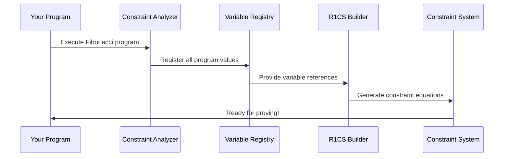

# Chapter 9: R1CS Constraint System

In the previous chapter, we learned how [Commitment Schemes](08_commitment_schemes_.md) allow us to create cryptographic "sealed envelopes" that hide our computation data while still allowing us to prove properties about it. But here's a fundamental question: how do we actually express our computational problems in a mathematical form that cryptographic systems can work with? When your Fibonacci program executes, how do we translate "this computation is correct" into mathematical equations that can be proven? The answer lies in the **R1CS Constraint System** - the mathematical framework that transforms any computation into a system of algebraic equations.

## What Problem Does This Solve?

Imagine you're a math teacher creating a test where every problem can be written as "A × B = C". No matter how complex the original problem is - whether it's calculating compound interest, solving physics equations, or computing Fibonacci numbers - you want to transform everything into this simple multiplication format. This makes grading consistent and systematic.

The R1CS (Rank-1 Constraint System) does exactly this for zero-knowledge proofs. It takes any computation and transforms it into a standardized mathematical format where every computational step becomes an equation of the form:

**A × B = C**

This transformation allows the cryptographic proving system to handle any computation uniformly. Instead of needing separate proof systems for addition, multiplication, memory access, and conditional logic, we have one universal system that proves "these equations are all satisfied."

Let's see this in action with our Fibonacci example:

```rust
// Your Fibonacci computation: let sum = a + b;
// Becomes an R1CS constraint equation:
// a_poly × 1 = sum_poly

// Your conditional: if (n > 1) then recurse
// Becomes an R1CS constraint equation:  
// condition_poly × (result_true - result_false) = (actual_result - result_false)
```

This transformation allows the [Jolt zkVM Core](02_jolt_zkvm_core_.md) to prove that your entire Fibonacci computation was executed correctly by simply proving that all the constraint equations are satisfied!

## Key Concepts

### The Universal Equation Format

Think of R1CS constraints like a universal translator that converts any computational step into the same basic pattern:

```rust
// Every constraint has this form:
pub struct Constraint {
    pub a: LC,  // Left side of multiplication  
    pub b: LC,  // Right side of multiplication
    pub c: LC,  // Expected result
}
// Represents: A × B = C
```

**A**, **B**, and **C** aren't just single numbers - they're **Linear Combinations (LC)** of variables from your computation. Think of them like mathematical recipes that combine multiple ingredients.

### Linear Combinations: Mathematical Recipes

A Linear Combination is like a recipe that mixes different variables with specific weights:

```rust
// A linear combination might look like:
// 3 × variable_1 + 2 × variable_2 + 5 × variable_3
let lc = 3 * var1 + 2 * var2 + 5 * var3;
```

Just like a recipe combines "2 cups flour + 1 cup sugar + 3 eggs," a linear combination combines variables with coefficients to create one side of our constraint equation.

### Variables: The Building Blocks

Variables in R1CS represent all the data in your computation:

```rust
pub enum Variable {
    Input(usize),    // Points to a specific input/witness value
    Constant,        // Represents the constant value 1
}
```

These variables reference the values from your program execution - register contents, memory values, instruction flags, etc. They're like named boxes that hold the actual numbers from your computation.

### Constraint Building: From Code to Equations

The constraint system automatically converts your program operations into mathematical equations:

```rust
// Your code: assert_eq!(left, right)
// Becomes constraint: (left - right) × 1 = 0

// Your code: if condition { do_something }  
// Becomes constraint: condition × (action_taken - default) = (result - default)
```

Every computational step gets systematically converted into this mathematical format.

## Solving Our Use Case: Converting Fibonacci to R1CS

Let's walk through how to transform our Fibonacci computation into R1CS constraints:

### Step 1: Identify Computational Operations

```rust
// Our Fibonacci loop contains several operations:
let mut a = 0;        // Assignment operation
let mut b = 1;        // Assignment operation  
let sum = a + b;      // Addition operation
a = b;                // Assignment operation
b = sum;              // Assignment operation
```

Each of these operations will become one or more R1CS constraints that prove the operation was performed correctly.

### Step 2: Create Constraint Builder

```rust
let mut builder = R1CSBuilder::new();

// The builder helps us create constraints systematically
// It automatically handles the mathematical translations
```

The `R1CSBuilder` acts like a specialized translator that converts high-level operations into the mathematical constraint format.

### Step 3: Add Constraints for Each Operation

```rust
// Constrain that two values are equal: a = b
builder.constrain_eq(variable_a, variable_b);
// Becomes: (a - b) × 1 = 0

// Constrain that a multiplication is correct: x × y = result
builder.constrain_prod(variable_x, variable_y, variable_result);
// Becomes: x × y = result
```

Each constraint ensures that a specific computational step was performed correctly according to the rules of arithmetic.

### Step 4: Handle Conditional Logic

```rust
// For conditional execution: if condition then use value_true else value_false
builder.constrain_if_else(condition, value_true, value_false, actual_result);
// Becomes: condition × (value_true - value_false) = (actual_result - value_false)
```

Even complex conditional logic gets converted into simple multiplication constraints that can be efficiently proven.

## Under the Hood: How the Magic Works

Let's explore what happens when your program gets converted into R1CS constraints:

### Phase 1: Program Analysis and Variable Assignment



The system first analyzes your program execution and assigns a unique variable to every value that appears during computation:

```rust
// Every value in your program gets a variable assignment:
// variables[0] = initial_a (0)
// variables[1] = initial_b (1)  
// variables[2] = sum_result (a + b)
// variables[3] = updated_a (old b value)
// variables[4] = updated_b (sum value)
// ... and so on
```

This creates a complete map of all the data in your computation.

### Phase 2: Constraint Generation

For each computational step, the system generates appropriate constraints:

```rust
impl R1CSBuilder {
    // Addition: sum = a + b becomes constraint equations
    pub fn constrain_addition(&mut self, a: Variable, b: Variable, sum: Variable) {
        // We can't directly represent addition in R1CS (only multiplication)
        // So we use a range check table lookup to prove the addition
        self.constrain_prod(
            a + b,           // Linear combination: a + b
            Variable::Constant, // Multiply by 1
            sum              // Should equal sum
        );
    }
}
```

The builder automatically handles the mathematical transformations needed to represent each operation type.

### Phase 3: Linear Combination Construction

Linear combinations get built from individual terms and coefficients:

```rust
pub struct LC {
    terms: Vec<Term>,     // List of variable × coefficient pairs
    constant: Option<i64>, // Optional constant term
}

// Example: 3×a + 2×b + 5 becomes:
// terms = [(Variable::Input(a_index), 3), (Variable::Input(b_index), 2)]
// constant = Some(5)
```

This structure allows complex mathematical expressions to be represented efficiently while maintaining the multiplication-only constraint format.

### Phase 4: Constraint Matrix Creation

The individual constraints get organized into large sparse matrices:

```rust
pub struct UniformR1CS<F: JoltField> {
    pub a: SparseConstraints<F>,  // A matrix (left multiplication)
    pub b: SparseConstraints<F>,  // B matrix (right multiplication) 
    pub c: SparseConstraints<F>,  // C matrix (expected results)
    pub num_vars: usize,          // Number of variables
    pub num_rows: usize,          // Number of constraints
}
```

Each matrix stores only the non-zero entries to save memory, since most entries in large constraint systems are zero.

## Integration with Jolt Components

The R1CS Constraint System integrates seamlessly with other Jolt components:

### Working with Field Arithmetic

All constraint operations use the field arithmetic from [Field Arithmetic and Cryptographic Fields](04_field_arithmetic_and_cryptographic_fields_.md):

```rust
// Constraint coefficients are field elements
let coeff = F::from_i64(3);  // Coefficient 3 in the field

// All arithmetic happens in the cryptographic field
let linear_combo = coeff * variable_value;
```

This ensures all mathematical operations are cryptographically secure and consistent.

### Integration with Lookup Tables

Complex operations use [Lookup Tables and Instructions](06_lookup_tables_and_instructions_.md) within the constraint framework:

```rust
// Multiplication constraint might use a lookup table
builder.constrain_prod(
    rs1_value,          // First operand
    rs2_value,          // Second operand  
    lookup_result       // Result from multiplication table
);
```

The constraint system seamlessly incorporates precomputed lookup results as constraint variables.

### Memory Operation Constraints

[Memory and RAM Management](07_memory_and_ram_management_.md) operations become memory consistency constraints:

```rust
// Memory load: value = memory[address] 
builder.constrain_eq(
    loaded_value,
    memory_lookup(address)  // Uses memory consistency proofs
);
```

Every memory access gets its own constraint ensuring the loaded value matches what was actually stored at that address.

### Polynomial Representation

The constraint matrices get converted to [Multilinear Polynomials](05_multilinear_polynomials_.md) for efficient proving:

```rust
// Sparse matrices become polynomial coefficients
let a_poly = MultilinearPolynomial::from(a_matrix.coefficients());
let b_poly = MultilinearPolynomial::from(b_matrix.coefficients());
let c_poly = MultilinearPolynomial::from(c_matrix.coefficients());
```

This transformation enables the advanced cryptographic techniques used in the proving system.

## Advanced Constraint Types

The R1CS system supports several specialized constraint patterns:

### Binary Constraints

```rust
// Ensure a value is either 0 or 1
builder.constrain_binary(flag_variable);
// Becomes: flag × (1 - flag) = 0
```

Binary constraints are essential for proving boolean logic and conditional execution.

### Packing Constraints

```rust
// Pack multiple small values into one large value
let packed_vars = vec![bit0, bit1, bit2, bit3];
builder.constrain_pack_le(packed_vars, packed_result, 1);
// Becomes: bit0 + 2×bit1 + 4×bit2 + 8×bit3 = packed_result
```

Packing constraints efficiently represent bit manipulations and data encoding operations.

### Conditional Constraints

```rust
// Enforce constraints only when a condition is true
builder.constrain_eq_conditional(condition, left_value, right_value);
// Becomes: condition × (left - right) = 0
```

Conditional constraints handle program branching and optional operations efficiently.

## Real-World Performance Characteristics

The R1CS system is optimized for practical zero-knowledge proving:

```rust
// Typical constraint counts for common operations:
// - Simple arithmetic: 1-3 constraints per operation
// - Conditional logic: 2-5 constraints per branch  
// - Memory access: 3-10 constraints per load/store
// - Function calls: 5-20 constraints per call
//
// For Fibonacci(50): ~200-500 total constraints
// Constraint generation: ~1-10 milliseconds
// Matrix materialization: ~10-100 milliseconds
```

The system automatically optimizes constraint generation for common patterns, ensuring efficient proving even for complex programs.

### Memory Optimization

```rust
// Sparse matrix storage saves significant memory
let sparse_storage = SparseConstraints::empty_with_capacity(
    estimated_nonzero_entries,
    num_constraint_rows
);
```

By storing only non-zero entries, the system handles large constraint systems efficiently without excessive memory usage.

## Debugging and Analysis Tools

The R1CS system provides tools for understanding constraint generation:

```rust
// Pretty print constraints for debugging
let mut debug_output = String::new();
constraint.pretty_fmt(
    &mut debug_output,
    &witness_polynomials, 
    step_index
);
println!("Constraint: {}", debug_output);
```

This helps developers understand how their programs translate to mathematical constraints and optimize for efficient proving.

### Constraint Analysis

```rust
// Analyze constraint system properties
println!("Total constraints: {}", builder.constraints.len());
println!("Total variables: {}", JoltR1CSInputs::num_inputs());
println!("Matrix sparsity: {:.2}%", calculate_sparsity(&matrices));
```

These metrics help optimize programs for efficient constraint generation and proving.

## Integration with the Proving Pipeline

R1CS constraints feed directly into the proving system:

### Sumcheck Protocol Integration

The [Sumcheck Protocol](10_sumcheck_protocol_.md) uses R1CS matrices to generate proofs:

```rust
// Sumcheck proves: Σ_x eq(τ, x) × (A(x) × B(x) - C(x)) = 0
let sumcheck_proof = prove_r1cs_satisfaction(
    &a_matrix,
    &b_matrix, 
    &c_matrix,
    &witness_values
);
```

This integration allows the sumcheck protocol to efficiently prove that all constraint equations are satisfied.

### Commitment Scheme Integration

Constraint matrices get committed using [Commitment Schemes](08_commitment_schemes_.md):

```rust
// Commit to constraint matrices and witness values
let a_commitment = commit_to_polynomial(&a_matrix_poly);
let b_commitment = commit_to_polynomial(&b_matrix_poly);
let witness_commitment = commit_to_polynomial(&witness_poly);
```

These commitments enable zero-knowledge proofs about constraint satisfaction without revealing the actual computation data.

## Conclusion

The R1CS Constraint System serves as the universal mathematical translator that converts any computation into a standardized equation format. It transforms the complex challenge of proving arbitrary program correctness into the simpler problem of proving that a system of multiplication equations is satisfied.

This system works seamlessly with the field arithmetic from [Field Arithmetic and Cryptographic Fields](04_field_arithmetic_and_cryptographic_fields_.md), the polynomial structures from [Multilinear Polynomials](05_multilinear_polynomials_.md), and the optimization techniques from [Lookup Tables and Instructions](06_lookup_tables_and_instructions_.md). By providing a uniform mathematical framework, R1CS enables all the advanced cryptographic techniques that make practical zero-knowledge proofs possible.

In the next chapter, we'll explore the [Sumcheck Protocol](10_sumcheck_protocol_.md) to understand how the mathematical constraint equations we've created get efficiently proven using interactive proof techniques.

---

Generated by [AI Codebase Knowledge Builder](https://github.com/The-Pocket/Tutorial-Codebase-Knowledge)