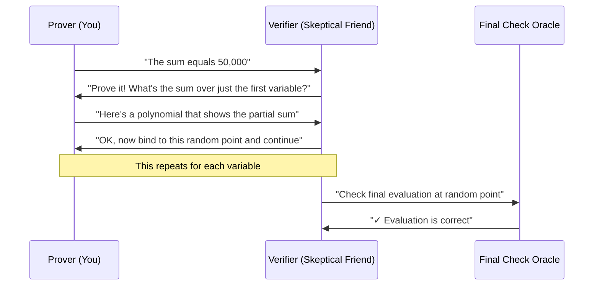
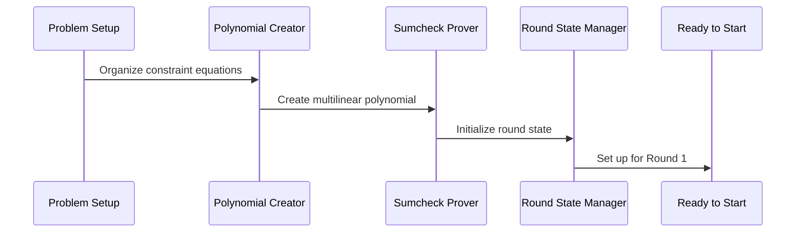

# Chapter 10: Sumcheck Protocol

In the previous chapter, we learned how the [R1CS Constraint System](09_r1cs_constraint_system_.md) transforms any computation into a standardized mathematical format where every computational step becomes an equation of the form "A × B = C". But here's the crucial final piece of the puzzle: how do we efficiently prove that all these constraint equations are satisfied without checking each one individually? When your Fibonacci program generates thousands of constraint equations, how can we prove they're all correct in a time that's much faster than verifying each constraint separately? The answer lies in the **Sumcheck Protocol** - the cryptographic technique that allows proving the sum of a polynomial over all possible inputs without computing every single value.

## What Problem Does This Solve?

Imagine you're a teacher with 1000 students, and each student solved a math problem that resulted in a number. You want to prove to the principal that the sum of all their answers equals exactly 50,000, but you don't want to reveal any individual student's answer or spend time adding up all 1000 numbers in front of the principal.

The Sumcheck Protocol works exactly like this mathematical magic trick. It allows you to:

- **Prove sums efficiently**: Prove that a massive sum equals a specific value without computing every term
- **Maintain privacy**: Don't reveal the individual values that make up the sum
- **Enable interaction**: Use a back-and-forth conversation with a verifier to build confidence
- **Reduce verification time**: Turn a potentially huge verification task into a small, manageable one

Let's see this in action with our Fibonacci example:

```rust
// Instead of checking all constraint equations individually:
// constraint_1: a₁ × b₁ = c₁ ✓
// constraint_2: a₂ × b₂ = c₂ ✓
// ... (thousands of constraints)

// We use sumcheck to prove:
let sum_claim = Fr::from_u64(12345); // The claimed sum of all constraints
let sumcheck_proof = prove_constraint_satisfaction(&constraints, sum_claim);
// Proves: ∑(aᵢ × bᵢ - cᵢ) = 0 (all constraints satisfied)
```

This transformation allows the [Jolt zkVM Core](02_jolt_zkvm_core_.md) to prove that your entire Fibonacci computation was correct by proving just one sum equation instead of thousands of individual constraint equations!

## Key Concepts

### The Interactive Proof Structure

Think of the Sumcheck Protocol like a game between two players - a Prover (who wants to convince) and a Verifier (who wants to be convinced):



The Verifier asks the Prover to progressively "zoom in" on smaller and smaller parts of the sum until they reach a single evaluation that can be checked directly.

### Polynomial Evaluation Games

The sumcheck protocol works with polynomials - mathematical functions that take multiple inputs. Think of a polynomial like a complex recipe:

```rust
// A polynomial might look like:
// P(x,y,z) = 3xy + 2xz + 5yz + 7xyz + 4x + 6y + 8z + 9

// The sumcheck proves:
// ∑∑∑ P(x,y,z) = claimed_value
// where each sum goes over x,y,z ∈ {0,1}
```

Instead of computing this sum directly (which requires 2³ = 8 evaluations), sumcheck reduces it to just a few interactive rounds.

### Round-by-Round Reduction

Each round of sumcheck reduces the problem size by half:

```rust
// Round 1: Prover sends polynomial g₁(X) representing ∑ᵧ,ᵤ P(X,y,z)
// Verifier picks random r₁, reduces to proving ∑ᵧ P(r₁,y,z) = g₁(r₁)

// Round 2: Prover sends polynomial g₂(Y) representing ∑ᵤ P(r₁,Y,z)  
// Verifier picks random r₂, reduces to proving P(r₁,r₂,z) = g₂(r₂)

// Round 3: Prover sends polynomial g₃(Z) = P(r₁,r₂,Z)
// Verifier picks random r₃, reduces to checking P(r₁,r₂,r₃) = g₃(r₃)
```

Each round eliminates one variable, making the problem smaller and smaller.

## Solving Our Use Case: Proving Fibonacci Constraint Satisfaction

Let's walk through how to use the Sumcheck Protocol to prove that all the constraint equations from our Fibonacci computation are satisfied:

### Step 1: Set Up the Sum to Prove

```rust
// We want to prove: ∑(aᵢ × bᵢ - cᵢ) = 0 for all constraint equations
// This proves all constraints are satisfied

let constraint_polynomial = create_constraint_polynomial(&fibonacci_constraints);
let claimed_sum = Fr::zero(); // We claim the sum is 0 (all constraints satisfied)
```

Our constraint polynomial encodes all the A × B = C equations from the [R1CS Constraint System](09_r1cs_constraint_system_.md). If all constraints are satisfied, their sum should be zero.

### Step 2: Start the Interactive Proof

```rust
let mut sumcheck_prover = SumcheckProver::new(
    constraint_polynomial,
    claimed_sum
);

let mut transcript = KeccakTranscript::new(b"fibonacci_sumcheck");
```

The transcript acts like a shared notebook where both the Prover and Verifier write down their messages, ensuring the interaction is cryptographically secure.

### Step 3: Execute the Sumcheck Rounds

```rust
for round in 0..num_variables {
    // Prover computes partial sum polynomial for this round
    let round_polynomial = sumcheck_prover.compute_round_polynomial(round);
    
    // Add polynomial to transcript
    round_polynomial.append_to_transcript(&mut transcript);
    
    // Verifier generates random challenge
    let challenge = transcript.challenge_scalar();
    
    // Bind polynomial to challenge for next round
    sumcheck_prover.bind_variable(challenge);
}
```

Each round eliminates one variable from our sum, progressively reducing the problem size until we reach a single polynomial evaluation.

### Step 4: Final Verification

```rust
// After all rounds, we have a single evaluation claim
let final_point = sumcheck_prover.get_evaluation_point();
let claimed_evaluation = sumcheck_prover.get_final_evaluation();

// Verifier checks this evaluation using polynomial commitments
let is_valid = verify_final_evaluation(
    &constraint_polynomial,
    &final_point,
    claimed_evaluation
);
```

The final check verifies that the polynomial really does evaluate to the claimed value at the random point chosen through the interactive process.

## Under the Hood: How the Magic Works

Let's explore what happens when you run the Sumcheck Protocol step by step:

### Phase 1: Problem Setup and Polynomial Organization



The system first organizes your constraint equations into a mathematical polynomial structure:

```rust
// Convert R1CS constraints into polynomial form
impl SumcheckInstance for R1CSConstraintSystem {
    fn setup_polynomial(&self) -> MultilinearPolynomial<F> {
        // Organize A, B, C matrices into polynomial coefficients
        let a_poly = MultilinearPolynomial::from(self.a_matrix);
        let b_poly = MultilinearPolynomial::from(self.b_matrix);
        let c_poly = MultilinearPolynomial::from(self.c_matrix);
        
        // Create constraint polynomial: A(x) * B(x) - C(x)
        create_constraint_polynomial(a_poly, b_poly, c_poly)
    }
}
```

This setup transforms your constraint system from the [R1CS Constraint System](09_r1cs_constraint_system_.md) into the polynomial format that sumcheck can work with.

### Phase 2: Round-by-Round Execution

For each round of the protocol, the system performs a careful dance of polynomial manipulation:

```rust
impl SumcheckProver {
    fn compute_round_polynomial(&mut self, round: usize) -> UnivariatePoly<F> {
        // For round i, we compute g_i(X) = ∑_{x_{i+1},...,x_n} P(r_1,...,r_{i-1}, X, x_{i+1},...,x_n)
        
        let mut evaluations = Vec::new();
        
        // Evaluate at several points to determine polynomial
        for eval_point in 0..=degree {
            let partial_sum = self.compute_partial_sum(round, eval_point);
            evaluations.push(partial_sum);
        }
        
        // Interpolate polynomial from evaluations
        UnivariatePoly::from_evaluations(&evaluations)
    }
}
```

This computation is where the real work happens - the prover computes how the sum behaves as one variable changes, while keeping all other variables bound to their chosen values.

### Phase 3: Polynomial Binding and State Updates

After each round, the system updates its state based on the verifier's challenge:

```rust
impl SumcheckProver {
    fn bind_variable(&mut self, challenge: F) {
        // Update polynomial by binding current variable to challenge
        self.constraint_polynomial.bind(challenge);
        
        // Update evaluation point for final check
        self.evaluation_point.push(challenge);
        
        // Move to next round
        self.current_round += 1;
    }
}
```

This binding process uses the techniques from [Multilinear Polynomials](05_multilinear_polynomials_.md) to progressively reduce the polynomial's dimensionality.

### Phase 4: Verification and Final Check

The final verification step ensures the entire protocol was executed correctly:

```rust
impl SumcheckVerifier {
    fn verify_sumcheck(&self, proof: &SumcheckProof) -> bool {
        let mut current_claim = proof.initial_claim;
        
        // Verify each round's polynomial
        for (round, poly) in proof.round_polynomials.iter().enumerate() {
            // Check that polynomial evaluations are consistent
            if poly.evaluate(F::zero()) + poly.evaluate(F::one()) != current_claim {
                return false;
            }
            
            // Update claim for next round
            let challenge = proof.challenges[round];
            current_claim = poly.evaluate(challenge);
        }
        
        // Final check: verify polynomial evaluation at random point
        self.verify_final_evaluation(proof.evaluation_point, current_claim)
    }
}
```

This verification process ensures that each step of the sumcheck was performed correctly and that the final polynomial evaluation matches what the prover claimed.

## The Batched Sumcheck Optimization

For efficiency, Jolt often runs multiple sumcheck protocols in parallel using a technique called "batching":

### Combining Multiple Sumchecks

```rust
// Instead of proving multiple sums separately:
// Sum 1: ∑ P₁(x) = claim₁
// Sum 2: ∑ P₂(x) = claim₂  
// Sum 3: ∑ P₃(x) = claim₃

// We prove one combined sum:
// ∑ (α₁ × P₁(x) + α₂ × P₂(x) + α₃ × P₃(x)) = α₁ × claim₁ + α₂ × claim₂ + α₃ × claim₃

let batching_coeffs = transcript.challenge_vector(num_sumchecks);
let batched_claim = combine_claims(&individual_claims, &batching_coeffs);
```

This batching technique reduces both the proof size and verification time by combining multiple sumcheck protocols into a single interactive proof.

### Batch Verification Process

```rust
impl BatchedSumcheck {
    fn verify_batch(
        sumcheck_instances: &[SumcheckInstance],
        proof: &BatchedSumcheckProof,
        transcript: &mut Transcript
    ) -> bool {
        // Generate batching coefficients
        let coeffs = transcript.challenge_vector(sumcheck_instances.len());
        
        // Combine individual claims
        let combined_claim = sumcheck_instances
            .iter()
            .zip(coeffs.iter())
            .map(|(instance, coeff)| instance.claim() * coeff)
            .sum();
        
        // Verify the combined sumcheck proof
        self.verify_single_sumcheck(combined_claim, proof, transcript)
    }
}
```

This optimization is crucial for making practical zero-knowledge proofs fast enough for real-world applications.

## Integration with Other Jolt Components

The Sumcheck Protocol integrates seamlessly with other parts of the Jolt system:

### Working with Multilinear Polynomials

The sumcheck relies heavily on the polynomial structures from [Multilinear Polynomials](05_multilinear_polynomials_.md):

```rust
// Sumcheck operates on multilinear polynomials
let constraint_poly = MultilinearPolynomial::from(constraint_coefficients);

// Each round binds one variable using polynomial binding
constraint_poly.bind(challenge, BindingOrder::HighToLow);

// Final evaluation uses efficient polynomial evaluation
let final_value = constraint_poly.evaluate(&evaluation_point);
```

The multilinear structure ensures that each round of sumcheck reduces the problem size predictably and efficiently.

### Integration with Commitment Schemes

[Commitment Schemes](08_commitment_schemes_.md) provide the final verification step for sumcheck:

```rust
// After sumcheck, verify the final polynomial evaluation
let commitment = polynomial_commitment_scheme.commit(&constraint_poly);
let evaluation_proof = prove_evaluation(
    &constraint_poly, 
    &evaluation_point, 
    final_claimed_value
);

// Verifier checks the evaluation proof
let is_valid = verify_evaluation(
    &commitment,
    &evaluation_point, 
    final_claimed_value,
    &evaluation_proof
);
```

This integration ensures that the final step of sumcheck verification is both efficient and cryptographically secure.

### Memory and Lookup Table Integration

Complex operations use [Lookup Tables and Instructions](06_lookup_tables_and_instructions_.md) within the sumcheck framework:

```rust
// Lookup table operations become sumcheck instances
impl SumcheckInstance for LookupTableConstraint {
    fn compute_round_polynomial(&mut self, round: usize) -> UnivariatePoly<F> {
        // Prove lookup consistency using sumcheck
        self.prove_lookup_consistency(round)
    }
}
```

This allows even complex operations like multiplication and division to be proven efficiently within the sumcheck framework.

## Real-World Performance Characteristics

The Sumcheck Protocol provides dramatic efficiency improvements:

```rust
// Performance comparison for 10,000 constraints:
//
// Direct verification: Check each constraint individually
// Time: ~10,000 field operations
// Proof size: ~10,000 field elements
//
// Sumcheck verification: Interactive polynomial proof  
// Time: ~20 rounds × ~10 operations = ~200 field operations
// Proof size: ~20 polynomials = ~60 field elements
//
// 50x improvement in verification time!
// 160x improvement in proof size!
```

This efficiency gain is what makes practical zero-knowledge proofs possible for complex programs

---

Generated by [AI Codebase Knowledge Builder](https://github.com/The-Pocket/Tutorial-Codebase-Knowledge)