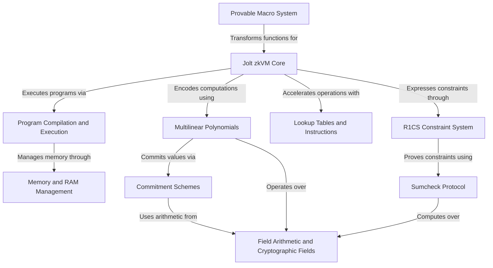

# Tutorial: jolt

**Jolt** is a *zero-knowledge virtual machine (zkVM)* that proves the correct execution of **RISC-V programs** without revealing sensitive data. 
It transforms regular Rust functions into *cryptographically provable computations* using advanced mathematical techniques like **multilinear polynomials** and **lookup tables**. 
The system acts like a "magical witness" that can mathematically guarantee your program ran correctly while keeping its secrets hidden.

**Source Repository:** [None](None)

## Chapters

1. [Provable Macro System
](01_provable_macro_system_.md)
2. [Jolt zkVM Core
](02_jolt_zkvm_core_.md)
3. [Program Compilation and Execution
](03_program_compilation_and_execution_.md)
4. [Field Arithmetic and Cryptographic Fields
](04_field_arithmetic_and_cryptographic_fields_.md)
5. [Multilinear Polynomials
](05_multilinear_polynomials_.md)
6. [Lookup Tables and Instructions
](06_lookup_tables_and_instructions_.md)
7. [Memory and RAM Management
](07_memory_and_ram_management_.md)
8. [Commitment Schemes
](08_commitment_schemes_.md)
9. [R1CS Constraint System
](09_r1cs_constraint_system_.md)
10. [Sumcheck Protocol
](10_sumcheck_protocol_.md)

---

Generated by [AI Codebase Knowledge Builder](https://github.com/The-Pocket/Tutorial-Codebase-Knowledge)